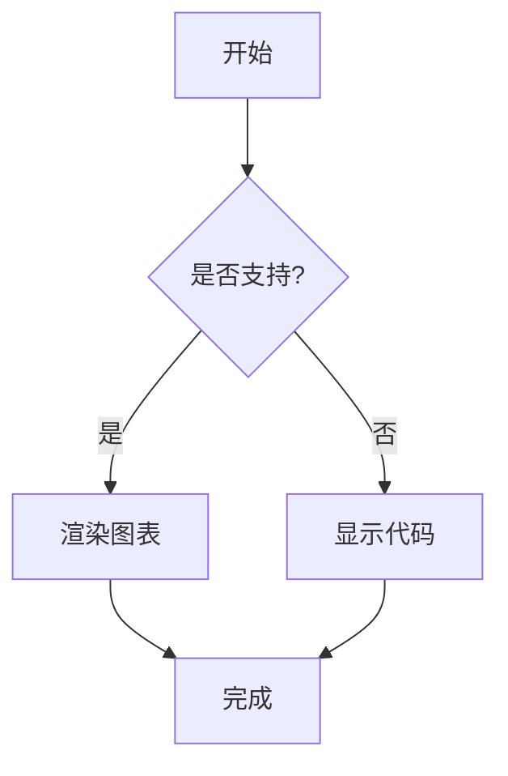
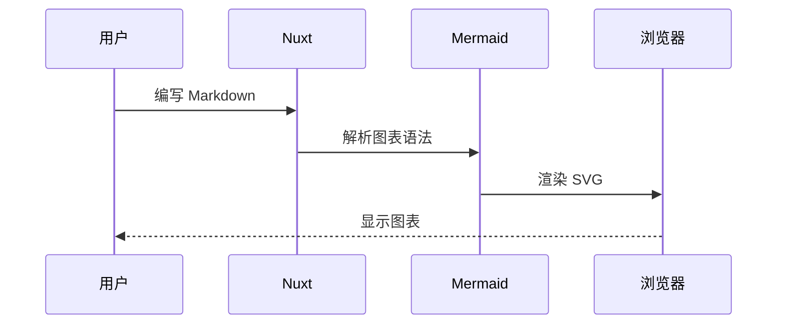

# 📋 Changelog

## [1.17.7](https://github.com/mhaibaraai/movk-nuxt-docs/compare/v1.17.6...v1.17.7) (2026-04-10)

### 🐛 Bug Fixes

* **module:** 修复 `updateSiteConfig` 的类型报错 ([9ad96f6](https://github.com/mhaibaraai/movk-nuxt-docs/commit/9ad96f686db89fb2cf04c3fb44c997e7a39c1795))

### 🔧 Chores

* **deps:** update ai-sdk ([5ef90bb](https://github.com/mhaibaraai/movk-nuxt-docs/commit/5ef90bbecb083009d63a84beab3ee67ffaca58dd))
* **deps:** update all non-major dependencies ([423bf6d](https://github.com/mhaibaraai/movk-nuxt-docs/commit/423bf6d5469988196c016ce7a5522e511f3254f8))
* **deps:** update dependency nuxt-og-image to ^6.3.6 ([97bf671](https://github.com/mhaibaraai/movk-nuxt-docs/commit/97bf671964e3ded6901dcfb55cd356625631a0be))

## [1.17.6](https://github.com/mhaibaraai/movk-nuxt-docs/compare/v1.17.5...v1.17.6) (2026-04-08)

### 🐛 Bug Fixes

* 修正 Mermaid 组件路径引用 ([e99118e](https://github.com/mhaibaraai/movk-nuxt-docs/commit/e99118ed2ee8ff28e3db8481ba647a203b75e59c))

### ♻️ Code Refactoring

* **fonts:** 简化阿里巴巴普惠体字体配置 ([37d78e0](https://github.com/mhaibaraai/movk-nuxt-docs/commit/37d78e09d49a1a9c3bcfd57ac9a1e8aec3782238))

## [1.17.5](https://github.com/mhaibaraai/movk-nuxt-docs/compare/v1.17.4...v1.17.5) (2026-04-08)

### 📝 Documentation

* **mcp:** 更新至最新版本支持 ([c609828](https://github.com/mhaibaraai/movk-nuxt-docs/commit/c609828c4300b4b731d102e342bccf5e711b6d80))
* 改进页面提示词用于 AI 工具 ([9186ee3](https://github.com/mhaibaraai/movk-nuxt-docs/commit/9186ee3e537d60dceeedffedc8943942f8e459d9))

### 🔧 Chores

* **deps:** update ai-sdk ([a477656](https://github.com/mhaibaraai/movk-nuxt-docs/commit/a477656e67b9809c62b9ac885b97c373fcc67f90))
* **deps:** update dependency nuxt-og-image to ^6.3.3 ([f7c39b5](https://github.com/mhaibaraai/movk-nuxt-docs/commit/f7c39b54e20e6d7c16cae7f5e42adb6cdb4f7b28))
* **deps:** 更新依赖锁文件 ([9b1fa5a](https://github.com/mhaibaraai/movk-nuxt-docs/commit/9b1fa5a70418a012611882944070570cf905c4cf))

## [1.17.4](https://github.com/mhaibaraai/movk-nuxt-docs/compare/v1.17.3...v1.17.4) (2026-04-07)

### 🐛 Bug Fixes

* **ai-chat:** 统一本地存储键名为 kebab-case ([efc8c9e](https://github.com/mhaibaraai/movk-nuxt-docs/commit/efc8c9e0839c7ea078c444c2e5ad0992c011dfb5))

### 🔧 Chores

* **deps:** update ai-sdk ([6f1b6fa](https://github.com/mhaibaraai/movk-nuxt-docs/commit/6f1b6fa9db6719ebd40600ba46099f71f2150010))
* **deps:** update dependency @iconify-json/simple-icons to ^1.2.77 ([66d8f28](https://github.com/mhaibaraai/movk-nuxt-docs/commit/66d8f286b74f2d425749f3536c465007d74e01d4))
* **deps:** update dependency @nuxtjs/mcp-toolkit to ^0.13.4 ([a7b35ba](https://github.com/mhaibaraai/movk-nuxt-docs/commit/a7b35ba620b8d000514555391855c4d1e2470548))
* **deps:** update dependency defu to ^6.1.7 ([fa22466](https://github.com/mhaibaraai/movk-nuxt-docs/commit/fa22466c82d2b18b7c08ca6a2cbf5dc9c9dea149))
* **deps:** 更新依赖版本 ([a580fad](https://github.com/mhaibaraai/movk-nuxt-docs/commit/a580fad1d9667e7f978b8e818000bcee2a71dc8f))

## [1.17.3](https://github.com/mhaibaraai/movk-nuxt-docs/compare/v1.17.2...v1.17.3) (2026-04-06)

### 🐛 Bug Fixes

* **layer:** 统一 localStorage key 前缀为 kebab-case 格式 ([ff08c85](https://github.com/mhaibaraai/movk-nuxt-docs/commit/ff08c85feb4d9462df9b0803f38d7bf15056566d))

## [1.17.2](https://github.com/mhaibaraai/movk-nuxt-docs/compare/v1.17.1...v1.17.2) (2026-04-04)

### 🐛 Bug Fixes

* **layer:** 补全 AppConfig 类型声明并修复 defu 类型兼容性 ([36ee1d5](https://github.com/mhaibaraai/movk-nuxt-docs/commit/36ee1d5e90301c8d4022331d9f165808b12bd27b))

## [1.17.1](https://github.com/mhaibaraai/movk-nuxt-docs/compare/v1.17.0...v1.17.1) (2026-04-04)

### 🐛 Bug Fixes

* **docs:** 修复预渲染时的两处 404 断链 ([b379280](https://github.com/mhaibaraai/movk-nuxt-docs/commit/b37928005c04c50dffdf21142941db5ac650723f))
* **layer:** 将 providers 目录加入 npm 发布白名单并移除 sitemap 预渲染路由 ([dc036b1](https://github.com/mhaibaraai/movk-nuxt-docs/commit/dc036b155037cd04b226b44e6d5d4bf4a23bff95))

## [1.17.0](https://github.com/mhaibaraai/movk-nuxt-docs/compare/v1.16.3...v1.17.0) (2026-04-04)

### ✨ Features

* 优化 AI Chat 布局与交互体验 ([9fe0d9e](https://github.com/mhaibaraai/movk-nuxt-docs/commit/9fe0d9e68b6649575212d4943225777c8ad712f9))

### 🐛 Bug Fixes

* **layer:** 修复阿里普惠体字体权重映射过滤 ([ed33392](https://github.com/mhaibaraai/movk-nuxt-docs/commit/ed3339292e1869f12cf842517c76c2b100cbd589))
* 修复 AI Chat 用户消息渲染与布局隐藏问题 ([5820bda](https://github.com/mhaibaraai/movk-nuxt-docs/commit/5820bda67d07e05a0b57cd3696050b5592c0adef))
* 将 ThemePicker 中的相对链接替换为 Nuxt UI 文档绝对链接 ([0f3801b](https://github.com/mhaibaraai/movk-nuxt-docs/commit/0f3801b0440feb6561252173a42bbf2687af709f))

### 📝 Documentation

* 全面提升文档质量，修复截断内容并优化 SEO 元数据 ([a2833fb](https://github.com/mhaibaraai/movk-nuxt-docs/commit/a2833fba6dcdd93c33dd9f757a80b28263a1d9f9))
* 同步 docus PR [#1297](https://github.com/mhaibaraai/movk-nuxt-docs/issues/1297) 文档与 skills 说明 ([83e48d0](https://github.com/mhaibaraai/movk-nuxt-docs/commit/83e48d0bcefb75045fd0d4380c82b2342455a097))
* 更新 README.md，添加 AI 助手技能及一键安装说明 ([7ef84d2](https://github.com/mhaibaraai/movk-nuxt-docs/commit/7ef84d2cf405afda26e9135fda77d2a2968facb9))

### 🔧 Chores

* **deps:** update dependency @nuxt/ui to ^4.6.1 ([030ff1e](https://github.com/mhaibaraai/movk-nuxt-docs/commit/030ff1e98024850ceaf145e975f9c439f8235125))
* **deps:** update dependency @nuxtjs/mcp-toolkit to ^0.13.1 ([19fec6f](https://github.com/mhaibaraai/movk-nuxt-docs/commit/19fec6f147ac7685e00c5a99ad221a6dbd445392))
* **deps:** update dependency nuxt-og-image to ^6.3.2 ([cf2f9f4](https://github.com/mhaibaraai/movk-nuxt-docs/commit/cf2f9f4611ea0b46840e2d68e24dda092f124a40))
* **deps:** update dependency reka-ui to ^2.9.3 ([b979da5](https://github.com/mhaibaraai/movk-nuxt-docs/commit/b979da537f0b7c8d867efef25459146c969ef455))
* **deps:** update devdependency eslint to ^10.2.0 ([c48e852](https://github.com/mhaibaraai/movk-nuxt-docs/commit/c48e852b9c00c8254c1f12ef04fcd33ee34d8191))
* **deps:** update devdependency typescript to v6 ([765d252](https://github.com/mhaibaraai/movk-nuxt-docs/commit/765d252665e1207328d3451196a16480272c16d2))
* **deps:** update nuxt ([ee49718](https://github.com/mhaibaraai/movk-nuxt-docs/commit/ee4971808822a2d868cc52fad28ec1d482ec4408))

## [1.16.3](https://github.com/mhaibaraai/movk-nuxt-docs/compare/v1.16.2...v1.16.3) (2026-03-30)

### 🐛 Bug Fixes

* 修复 aiChat 配置访问的类型安全问题及 GitHub API 非空断言 ([c737cd4](https://github.com/mhaibaraai/movk-nuxt-docs/commit/c737cd4d379f264c2028399c368b66d7200caa61))

## [1.16.2](https://github.com/mhaibaraai/movk-nuxt-docs/compare/v1.16.1...v1.16.2) (2026-03-30)

### ♻️ Code Refactoring

* 使用 updateSiteConfig 替代直接赋值并调整模块注册方式 ([f5b5881](https://github.com/mhaibaraai/movk-nuxt-docs/commit/f5b58815286ec910ce3808db6cb67603e9207fbe))
* 合并 config 模块至 module.ts 并添加 robots 配置 ([43cebdd](https://github.com/mhaibaraai/movk-nuxt-docs/commit/43cebddba8f8ad2db8cd7ddc3ae9c5f48219f9e9))

## [1.16.1](https://github.com/mhaibaraai/movk-nuxt-docs/compare/v1.16.0...v1.16.1) (2026-03-29)

### 🐛 Bug Fixes

* 升级 nuxt-og-image 至 v6.3.0 并启用 zeroRuntime 模式 ([2773c0d](https://github.com/mhaibaraai/movk-nuxt-docs/commit/2773c0de8906b3127d1aa264513956c387dedd47))

### ♻️ Code Refactoring

* 迁移废弃的 MCP 工具响应 helper 并更新工具图标 ([6fc8817](https://github.com/mhaibaraai/movk-nuxt-docs/commit/6fc8817c1d53f1c516d02b3f82b88ffb3cbd5b20))

## [1.16.0](https://github.com/mhaibaraai/movk-nuxt-docs/compare/v1.15.0...v1.16.0) (2026-03-28)

### ✨ Features

* 移动 Mermaid 组件 ([89d74ae](https://github.com/mhaibaraai/movk-nuxt-docs/commit/89d74ae3f88cd012830f5ec1a77bbce1aeb5da93))

### 🐛 Bug Fixes

* 修复 OgImage 字体加载并添加静态资产支持 ([891c8e0](https://github.com/mhaibaraai/movk-nuxt-docs/commit/891c8e08327af4cffef759b1826e2ecbf997f228))

### ♻️ Code Refactoring

* 将 mermaid 和 a11y 合并为统一模块并内置 ProsePre ([4207626](https://github.com/mhaibaraai/movk-nuxt-docs/commit/4207626d12e0920b9172ea7df0a8d0afc23fd879))

### 🔧 Chores

* 升级依赖版本并同步 pnpm 版本 ([f8913a8](https://github.com/mhaibaraai/movk-nuxt-docs/commit/f8913a852d64630ad700ffc1fdfced8f2431fa5b))
* 同步 pnpm-lock.yaml 依赖版本说明符 ([4a0c67d](https://github.com/mhaibaraai/movk-nuxt-docs/commit/4a0c67d12b81747811feec793fef56aefe8ce922))

## [1.15.0](https://github.com/mhaibaraai/movk-nuxt-docs/compare/v1.14.2...v1.15.0) (2026-03-24)

### ✨ Features

* 升级 @nuxt/ui 至正式版，默认字体切换为 Public Sans（回退 Noto Sans SC），通过 Bunny Fonts 加载 ([4f0e4a9](https://github.com/mhaibaraai/movk-nuxt-docs/commit/4f0e4a9))
* 升级 nuxt-og-image 至 v6，迁移至自定义 Takumi 风格 OgImage 组件 ([d93878c](https://github.com/mhaibaraai/movk-nuxt-docs/commit/d93878c))
* AI Chat 移除 OpenRouter 支持，统一使用 @ai-sdk/gateway ([489c644](https://github.com/mhaibaraai/movk-nuxt-docs/commit/489c644))
* 重构主题系统，新增 `theme.font` 字体配置项 ([80a62cc](https://github.com/mhaibaraai/movk-nuxt-docs/commit/80a62cc))
* 将 @vueuse/nuxt 添加至 layer ([36d15df](https://github.com/mhaibaraai/movk-nuxt-docs/commit/36d15df))

### ♻️ Code Refactoring

* 重构 AI Chat 模块，简化配置并优化组件结构 ([ed4fc24](https://github.com/mhaibaraai/movk-nuxt-docs/commit/ed4fc24))
* 重构 layer 核心模块和组件 ([0330617](https://github.com/mhaibaraai/movk-nuxt-docs/commit/0330617))
* 移除 useAnalytics composable ([c93eb76](https://github.com/mhaibaraai/movk-nuxt-docs/commit/c93eb76))

### 🐛 Bug Fixes

* 修复 GitHub API handler 在无 token 时缓存空结果的问题 ([d15df15](https://github.com/mhaibaraai/movk-nuxt-docs/commit/d15df15))
* 完善 OG Image 标题样式并添加 Twitter Card 元标签 ([8389e1a](https://github.com/mhaibaraai/movk-nuxt-docs/commit/8389e1a))

### 🔧 Chores

* 更新所有非主版本依赖 ([70ded15](https://github.com/mhaibaraai/movk-nuxt-docs/commit/70ded15))

## [1.14.2](https://github.com/mhaibaraai/movk-nuxt-docs/compare/v1.14.1...v1.14.2) (2026-03-09)

### 🐛 Bug Fixes

* 修复悬浮输入框遮挡左侧菜单点击事件 ([d8ec0bd](https://github.com/mhaibaraai/movk-nuxt-docs/commit/d8ec0bd01c16088e72404fd6ac5eedfbb787ec68))

### 🔧 Chores

* **deps:** lock file maintenance ([14b91e2](https://github.com/mhaibaraai/movk-nuxt-docs/commit/14b91e291da9e5344711a7e2edcc9b4ca63e387b))
* **deps:** update all non-major dependencies ([6d3e4c2](https://github.com/mhaibaraai/movk-nuxt-docs/commit/6d3e4c2a9ab9d7a7ea7f578c1fdbe2c44095ca21))
* **deps:** update devdependency @nuxt/devtools to ^3.2.3 ([cb0ea0c](https://github.com/mhaibaraai/movk-nuxt-docs/commit/cb0ea0cf91972210bea693f0af435ba73bff8eea))

## [1.14.1](https://github.com/mhaibaraai/movk-nuxt-docs/compare/v1.14.0...v1.14.1) (2026-03-05)

### 🐛 Bug Fixes

* 修复 AI 聊天模型选择器宽度不自适应问题 ([b231613](https://github.com/mhaibaraai/movk-nuxt-docs/commit/b231613ec916c0e3d3b5ccae51de5566d7e31e25))

## [1.14.0](https://github.com/mhaibaraai/movk-nuxt-docs/compare/v1.13.1...v1.14.0) (2026-03-05)

### ✨ Features

* 配置 @nuxt/ui 主题色彩并升级 pnpm 版本 ([6fd2589](https://github.com/mhaibaraai/movk-nuxt-docs/commit/6fd25899849aa3f8d8a023ee54739e2aa01227b6))
* 集成 shiki-transformer-color-highlight 并优化图标高亮样式 ([ceebb87](https://github.com/mhaibaraai/movk-nuxt-docs/commit/ceebb87f46dcc7dcb25275b55af7fb7ff0908690))

### 🐛 Bug Fixes

* 使用 Nitro serverAssets 替代运行时文件读取修复 Vercel 部署 404 ([0cb2b89](https://github.com/mhaibaraai/movk-nuxt-docs/commit/0cb2b891ebd668178b23b18784e6fa843403d53f))

### ♻️ Code Refactoring

* 重命名组合式函数并优化 MCP 文档与 GitHub API ([8e207c2](https://github.com/mhaibaraai/movk-nuxt-docs/commit/8e207c2d08764a79a4031ea102c16c6393cbe0b0))

### 🔧 Chores

* 升级依赖并修复 llms.contentRawMarkdown 配置位置 ([d0a390a](https://github.com/mhaibaraai/movk-nuxt-docs/commit/d0a390ad1e800acd958a8ede06fc4cb2e2fdb3d0))
* 更新 AI SDK 依赖并重构模块加载方式 ([b6bcb1e](https://github.com/mhaibaraai/movk-nuxt-docs/commit/b6bcb1e5b16e8cdfa156577876fc68dcc0c1fc5f))
* 移除 minimark 依赖并实现自定义 stringifyMinimark 工具函数 ([cc3eceb](https://github.com/mhaibaraai/movk-nuxt-docs/commit/cc3eceb73a2869be3ba6b03ce8775c803e9504c9))
* 移除 Vercel 部署部分的 Node 版本支持说明 ([f3c972a](https://github.com/mhaibaraai/movk-nuxt-docs/commit/f3c972a15ffb7916c44b38a44f358a29b3ed1c61))

## [1.13.1](https://github.com/mhaibaraai/movk-nuxt-docs/compare/v1.13.0...v1.13.1) (2026-02-26)

### ✨ Features

* 按 Release 版本分组展示 CommitChangelog 提交历史 ([b7449b9](https://github.com/mhaibaraai/movk-nuxt-docs/commit/b7449b90bce8b48aa5c83fd98b18956f9650a20d))
* 添加 @nuxt/ui 依赖并优化 ESLint 配置 ([68832f0](https://github.com/mhaibaraai/movk-nuxt-docs/commit/68832f0bafd5863e987e58c4f6b904e4c04b77cb))

## [1.13.0](https://github.com/mhaibaraai/movk-nuxt-docs/compare/v1.12.4...v1.13.0) (2026-02-26)

### ✨ Features

* 将 Mermaid 改为可选模块，通过配置项按需启用 ([6117328](https://github.com/mhaibaraai/movk-nuxt-docs/commit/611732812d3a05843824cfdbd399aa20af75a60d))

## [1.12.4](https://github.com/mhaibaraai/movk-nuxt-docs/compare/v1.12.3...v1.12.4) (2026-02-25)

### ♻️ Code Refactoring

* remove custom modules from layer config and add LLMsSection type ([0a12973](https://github.com/mhaibaraai/movk-nuxt-docs/commit/0a129736dd051e34c19ae7382bd249cb5a97755d))
* 提取页面工具函数并重构 landing/releases 路由逻辑 ([1546b56](https://github.com/mhaibaraai/movk-nuxt-docs/commit/1546b563b8461553e6169da91801128e6f772ebc))

### 🔧 Chores

* **deps:** update all non-major dependencies ([729c1e2](https://github.com/mhaibaraai/movk-nuxt-docs/commit/729c1e205c1b8d51b686b0da7244f5015e9963a5))
* **deps:** update dependency minimark to v1 ([43370fd](https://github.com/mhaibaraai/movk-nuxt-docs/commit/43370fdf000b918586dbb10c3d4cf1667df8b173))
* **deps:** update dependency motion-v to v2 ([48b190c](https://github.com/mhaibaraai/movk-nuxt-docs/commit/48b190ca78b3fd86b985453db9604e885a96b3ed))
* **deps:** update pnpm lockfile ([2d8f7e1](https://github.com/mhaibaraai/movk-nuxt-docs/commit/2d8f7e1b3408c755d00c264ebf939132e3c5d63c))
* **deps:** 更新 fast-npm-meta 至 1.3.0 ([1ee029a](https://github.com/mhaibaraai/movk-nuxt-docs/commit/1ee029afe1f8d7824f27672ed03b2ee0faf0ee64))
* optimize build config and remove unused analytics ([0d636a9](https://github.com/mhaibaraai/movk-nuxt-docs/commit/0d636a92d17632e683cb7781bf1bd6eb4335bd87))
* 移除 Docker 相关配置文件 ([0ef673d](https://github.com/mhaibaraai/movk-nuxt-docs/commit/0ef673d2f7195b0278385b5c78d72d8dba789fb3))

## [1.12.3](https://github.com/mhaibaraai/movk-nuxt-docs/compare/v1.12.2...v1.12.3) (2026-02-10)

### 🔧 Chores

* 添加 @nuxtjs/mdc 和 unist-util-visit 依赖到模板 ([99a5c93](https://github.com/mhaibaraai/movk-nuxt-docs/commit/99a5c93a3f8a79f19d6de6940554e3e78869b55f))
* 添加 defineNuxtConfig 显式导入 ([b9d7000](https://github.com/mhaibaraai/movk-nuxt-docs/commit/b9d7000225a94ed68f1efcc64c3e2fcf96f6a151))

## [1.12.2](https://github.com/mhaibaraai/movk-nuxt-docs/compare/v1.12.1...v1.12.2) (2026-02-10)

### 📝 Documentation

* 重构故障排除文档格式并修正 Vercel 部署指南 ([a1d5a84](https://github.com/mhaibaraai/movk-nuxt-docs/commit/a1d5a84bc4e36679091e4d32c4787ba1558d49c5))

### ♻️ Code Refactoring

* 升级 Shiki 至模块化架构 ([cf815d1](https://github.com/mhaibaraai/movk-nuxt-docs/commit/cf815d1f29b923bb827da6d74f0ce76a4ca7a2eb))
* 禁用 WASM 插件配置 ([0da26b8](https://github.com/mhaibaraai/movk-nuxt-docs/commit/0da26b828d0c125415551abc9fd77df37a21ac86))
* 重构模块加载方式并优化 LLMs 链接生成 ([553930f](https://github.com/mhaibaraai/movk-nuxt-docs/commit/553930f7adfd4bc0cf7602c665e5a708eba557c0))

### 🔧 Chores

* 禁用 Nuxt telemetry ([e283804](https://github.com/mhaibaraai/movk-nuxt-docs/commit/e2838046b8268e8a2e11aab976cced0fd1e08d5e))
* 移除 '@swc/core' 依赖项 ([a2cb8ed](https://github.com/mhaibaraai/movk-nuxt-docs/commit/a2cb8ed715d756ee6d912d5957379551f3d51efe))

## [1.12.1](https://github.com/mhaibaraai/movk-nuxt-docs/compare/v1.12.0...v1.12.1) (2026-02-08)

### 📝 Documentation

* 添加 Layer README 文档 ([e4d1082](https://github.com/mhaibaraai/movk-nuxt-docs/commit/e4d1082d94b1ef46cba1a8079bace6df13585d45))

## [1.12.0](https://github.com/mhaibaraai/movk-nuxt-docs/compare/v1.11.1...v1.12.0) (2026-02-08)

### ✨ Features

* 添加 AI Skill 文档并更新 AI 聊天模型配置 ([13eda9c](https://github.com/mhaibaraai/movk-nuxt-docs/commit/13eda9c))
* 支持通过 nuxt.options.site.name 配置站点名称 ([17934c6](https://github.com/mhaibaraai/movk-nuxt-docs/commit/17934c6))

### 🐛 Bug Fixes

* 修复 Vite 7 插件类型不兼容问题并优化 ESLint 配置 ([e1e1603](https://github.com/mhaibaraai/movk-nuxt-docs/commit/e1e1603))

### 📝 Documentation

* 支持多包管理器安装选项 ([1cfa7a3](https://github.com/mhaibaraai/movk-nuxt-docs/commit/1cfa7a3))

### 🔧 Chores

* **deps:** update @iconify-json/simple-icons to v1.2.70 ([a1a39a0](https://github.com/mhaibaraai/movk-nuxt-docs/commit/a1a39a0))
* **deps:** update all non-major dependencies ([2b5fa1e](https://github.com/mhaibaraai/movk-nuxt-docs/commit/2b5fa1e))
* **deps:** update devdependency eslint to v10 ([8b4ec7c](https://github.com/mhaibaraai/movk-nuxt-docs/commit/8b4ec7c))
* **deps:** update nuxt framework to ^4.3.1 ([b20e31a](https://github.com/mhaibaraai/movk-nuxt-docs/commit/b20e31a))

## [1.11.1](https://github.com/mhaibaraai/movk-nuxt-docs/compare/v1.11.0...v1.11.1) (2026-02-02)

### 🐛 Bug Fixes

* 修复 mermaid ESM 兼容性问题 ([8d26f69](https://github.com/mhaibaraai/movk-nuxt-docs/commit/8d26f69a2fed2e24c6b5622529d603b5e67be484))

### 🔧 Chores

* **deps:** lock file maintenance ([69d45ce](https://github.com/mhaibaraai/movk-nuxt-docs/commit/69d45ce35181149a5b7b7213060ee30dc85d8ccc))
* **deps:** update all non-major dependencies ([4cfb1a0](https://github.com/mhaibaraai/movk-nuxt-docs/commit/4cfb1a08cae9e24e657426cce23ea8e64dfc776b))

## [1.11.0](https://github.com/mhaibaraai/movk-nuxt-docs/compare/v1.10.0...v1.11.0) (2026-01-31)

### ✨ Features

* 添加 Rollup 外部依赖配置以支持 env ([4e3f793](https://github.com/mhaibaraai/movk-nuxt-docs/commit/4e3f793f0d1c45b4618dd6ce40061943a8cdef3a))

### 🐛 Bug Fixes

* 修复 Node 24 环境下 WASM 构建报错及内存溢出 ([8a6380c](https://github.com/mhaibaraai/movk-nuxt-docs/commit/8a6380ca27915548e79db93fdebd7147d7809d8a))
* 修复构建内存溢出并优化 Shiki 配置 ([775d37f](https://github.com/mhaibaraai/movk-nuxt-docs/commit/775d37f983fad5c6711bf6391e8cd9ccc0bdf7cd))

### 📝 Documentation

* 优化发布日志文档和模板 ([9840171](https://github.com/mhaibaraai/movk-nuxt-docs/commit/98401716dc867f3f4b8d05eff249448895f6c25f))
* 更新 OG 图片 ([31bd9d8](https://github.com/mhaibaraai/movk-nuxt-docs/commit/31bd9d801862ad730792696498c702895d986727))

### ♻️ Code Refactoring

* 优化 WASM 配置并修复 Shiki transformer 类型问题 ([98545ce](https://github.com/mhaibaraai/movk-nuxt-docs/commit/98545cefb119ffa29412299abd650efd1d676368))
* 更新文档中对 app.config.ts 的引用为 app/app.config.ts ([00093c6](https://github.com/mhaibaraai/movk-nuxt-docs/commit/00093c6255ee6a0cf789f7598a0e17119461405b))

### 🔧 Chores

* **deps:** update all non-major dependencies ([b6f670e](https://github.com/mhaibaraai/movk-nuxt-docs/commit/b6f670e494e0974f6840596fad1e71a4653064c8))

## [1.10.0](https://github.com/mhaibaraai/movk-nuxt-docs/compare/v1.9.0...v1.10.0) (2026-01-30)

### ♻️ Code Refactoring

* 重构样式系统并清理项目配置 ([9841833](https://github.com/mhaibaraai/movk-nuxt-docs/commit/9841833685d1e8603a7b477bd6dc8b7c84afa602))

### 🔧 Chores

* **deps:** update all non-major dependencies ([e0f4956](https://github.com/mhaibaraai/movk-nuxt-docs/commit/e0f4956eb203b2de7952deeb750c440e5a939187))
* 使用语义化版本范围更新 @nuxtjs/mdc 依赖 ([36e14ca](https://github.com/mhaibaraai/movk-nuxt-docs/commit/36e14caba39c671e8a973b4ef278676c7496534e))

## [1.9.0](https://github.com/mhaibaraai/movk-nuxt-docs/compare/v1.8.1...v1.9.0) (2026-01-23)

### ✨ Features

* 新增 MCP 工具以支持组件示例查询 ([dcd7a1a](https://github.com/mhaibaraai/movk-nuxt-docs/commit/dcd7a1af10034e12bffc9bc59d2f7d8d9702456d))

### 📝 Documentation

* 更新和重组 MCP 与组件文档 ([8679828](https://github.com/mhaibaraai/movk-nuxt-docs/commit/8679828ab7a717502f35c598e066b6c35ecbc139))

### ♻️ Code Refactoring

* 优化服务端 API 和路由逻辑 ([5843483](https://github.com/mhaibaraai/movk-nuxt-docs/commit/584348361fa8b7f8d0a8bdaafd5426d4f7b03928))
* 重构核心模块和组件配置 ([0756228](https://github.com/mhaibaraai/movk-nuxt-docs/commit/07562285b82bba04b7fe9a15d63e5381b0641edb))

### 🔧 Chores

* **deps:** update all non-major dependencies ([f334d6f](https://github.com/mhaibaraai/movk-nuxt-docs/commit/f334d6f5c2b40c02761bb49b31c5d15ccd2efee5))
* **deps:** update nuxt framework to ^4.3.0 ([f2f05b2](https://github.com/mhaibaraai/movk-nuxt-docs/commit/f2f05b28b8da56844daf411f4fa136bfe0065a0a))
* 更新依赖和文档站点配置 ([d5b7c03](https://github.com/mhaibaraai/movk-nuxt-docs/commit/d5b7c036d53c1bdbba0b9c8317640677b0adc03c))

## [1.8.1](https://github.com/mhaibaraai/movk-nuxt-docs/compare/v1.8.0...v1.8.1) (2026-01-22)

### ✨ Features

* 添加模型提供商注册系统 ([3a104e4](https://github.com/mhaibaraai/movk-nuxt-docs/commit/3a104e47910d8c8a76503c04885ee67090a476a5)), closes [#ai-chat](https://github.com/mhaibaraai/movk-nuxt-docs/issues/ai-chat)

### 🐛 Bug Fixes

* 优化 Mermaid 图表渲染可见性检测 ([33192cd](https://github.com/mhaibaraai/movk-nuxt-docs/commit/33192cd62dfa26e9fd2a8b67e45edb30b0fd13a3))

### 📝 Documentation

* 优化 AI Chat 文档结构和描述 ([689c08a](https://github.com/mhaibaraai/movk-nuxt-docs/commit/689c08aaef1801f89bc36fbfd10d3393517f793f))

### 🔧 Chores

* **deps:** update all non-major dependencies ([2888522](https://github.com/mhaibaraai/movk-nuxt-docs/commit/2888522d732f0859f6df5bc708fe245567f384bf))
* 更新模型配置和依赖项 ([e8c8afa](https://github.com/mhaibaraai/movk-nuxt-docs/commit/e8c8afab635af3f8e85942063ee47471233c44f6))

## [1.8.0](https://github.com/mhaibaraai/movk-nuxt-docs/compare/v1.7.5...v1.8.0) (2026-01-21)

### ✨ Features

* **图表渲染：** 添加 Mermaid 图表支持 ([bc8c35a](https://github.com/mhaibaraai/movk-nuxt-docs/commit/bc8c35a), [文档](https://docs.mhaibaraai.cn/docs/typography/mermaid))
  - 支持流程图、时序图、类图、状态图、饼图、甘特图、实体关系图等 8 种图表、以及更多 [Mermaid 支持的图表类型](https://mermaid.js.org/intro/)
  - 自动主题切换（深色/浅色模式）和懒加载优化
  - 支持复制代码、全屏查看功能

#### 流程图：


````md

````

#### 时序图：


````md

````

### ⚡ Performance Improvements

* 优化 Mermaid 组件依赖和导入方式 ([7eca16c](https://github.com/mhaibaraai/movk-nuxt-docs/commit/7eca16ce1e8fc9cd47b00080b5e5d2daae7189f8))

### 📝 Documentation

* 📝 添加 Mermaid 图表功能文档 ([36de010](https://github.com/mhaibaraai/movk-nuxt-docs/commit/36de0102ba13fd79cbbbe084c8be6a721742bb9e))
* 优化 CHANGELOG 格式并移除冗余条目 ([acaea1d](https://github.com/mhaibaraai/movk-nuxt-docs/commit/acaea1de1c3fa4ce60614b5b1193a370479cc896))
* 补充 Mermaid 图表功能说明 ([3214708](https://github.com/mhaibaraai/movk-nuxt-docs/commit/3214708674c1963bdfaa76a120ebc9bb625a8968))

### ♻️ Code Refactoring

* 优化 TypeScript 注释指令 ([a6dda46](https://github.com/mhaibaraai/movk-nuxt-docs/commit/a6dda462b4d923015bf5ad148ceff07006532ef2))

### 📦 Build System

* 添加 mermaid 依赖 ([bc8c35a](https://github.com/mhaibaraai/movk-nuxt-docs/commit/bc8c35a8795c405b7653bb820536ebc4c1d267e8))

### 🔧 Chores

* **deps:** update all non-major dependencies ([a864a76](https://github.com/mhaibaraai/movk-nuxt-docs/commit/a864a76b4742a241fc7f1a3ca57db85ac67bebbf))
* **deps:** update dependency @openrouter/ai-sdk-provider to v2 ([e761d9a](https://github.com/mhaibaraai/movk-nuxt-docs/commit/e761d9ab9d6bd858d7c51dbfd8a0ba3a3254ca1b))

## [1.7.5](https://github.com/mhaibaraai/movk-nuxt-docs/compare/v1.7.4...v1.7.5) (2026-01-20)

### ✨ Features

* **ai-chat:** 优化系统提示并调整工具调用限制 ([8d4d627](https://github.com/mhaibaraai/movk-nuxt-docs/commit/8d4d627d00013102ec4648377abcb9180e9dedff))
* 添加 Phosphor 和 Tabler 图标库支持 ([7b87bff](https://github.com/mhaibaraai/movk-nuxt-docs/commit/7b87bffa3e032e5dd6bd6727c2389b1961a1b588))

### 🔧 Chores

* **ai-chat:** 更新日志标签名称为项目名称 ([8f966e0](https://github.com/mhaibaraai/movk-nuxt-docs/commit/8f966e07830cd08537fdfa3fe89e1bb0a800c834))
* **config:** 优化 Nuxt 配置项 ([b9a1586](https://github.com/mhaibaraai/movk-nuxt-docs/commit/b9a1586c466bfec2e4a518e8d7c535f3013ebd34))
* **deps:** update all non-major dependencies ([8374288](https://github.com/mhaibaraai/movk-nuxt-docs/commit/83742886338764e88fd6c805e237efd54aab37e5))

## [1.7.4](https://github.com/mhaibaraai/movk-nuxt-docs/compare/v1.7.3...v1.7.4) (2026-01-15)

### ✨ Features

* 添加 Markdown 原始文件访问支持 ([36b848e](https://github.com/mhaibaraai/movk-nuxt-docs/commit/36b848e335a96f085cbd513ea66c080792e479e7))

### ♻️ Code Refactoring

* **config:** 优化组件元数据配置和条件渲染 ([24173e6](https://github.com/mhaibaraai/movk-nuxt-docs/commit/24173e6e570671e16bc24fb46fdfcbaddce4f648))
* **config:** 优化配置模块加载和路径解析 ([c1ca327](https://github.com/mhaibaraai/movk-nuxt-docs/commit/c1ca32796bf321104918b5db850b392339f36501))

### 🔧 Chores

* **deps:** 升级 Prettier 至 3.7.4 ([e72cedb](https://github.com/mhaibaraai/movk-nuxt-docs/commit/e72cedb24e034270e5ddd4c833e143b82ae4df24))
* 移除测试用示例组件 ([d67dcc1](https://github.com/mhaibaraai/movk-nuxt-docs/commit/d67dcc1677c366bda5088d5c1ce4d20b39322d8e))

## [1.7.3](https://github.com/mhaibaraai/movk-nuxt-docs/compare/v1.7.2...v1.7.3) (2026-01-14)

### ⚡ Performance Improvements

* **config:** 优化构建配置减少内存消耗 ([85a8b88](https://github.com/mhaibaraai/movk-nuxt-docs/commit/85a8b88b04036262b82dfe6faa7d6fe7cf107d61))

## [1.7.2](https://github.com/mhaibaraai/movk-nuxt-docs/compare/v1.7.1...v1.7.2) (2026-01-14)

### ✨ Features

* **theme:** 添加主题配置 schema 并改进布局语义化 ([815c303](https://github.com/mhaibaraai/movk-nuxt-docs/commit/815c3039c59fd79294d1fb308d37485b0efc2e1b))

### 🐛 Bug Fixes

* **useTheme:** 修复 localStorage.setItem 类型错误 ([f39ae40](https://github.com/mhaibaraai/movk-nuxt-docs/commit/f39ae40e3d196a6d92f2f9aaf2ee3b0e5b022f3a))

### ♻️ Code Refactoring

* **ai-chat:** 使用原生 form 替代 UForm 组件 ([34b799d](https://github.com/mhaibaraai/movk-nuxt-docs/commit/34b799d740b258017bc67fd2d87c4deafbaeb64e))

### 🔧 Chores

* **deps:** update all non-major dependencies ([8487006](https://github.com/mhaibaraai/movk-nuxt-docs/commit/8487006f18f33ca9b08639d24423825c54767bca))

## [1.7.1](https://github.com/mhaibaraai/movk-nuxt-docs/compare/v1.7.0...v1.7.1) (2026-01-12)

### ♻️ Code Refactoring

* 将 StarsBg 组件移动到 layer 目录 ([b22cbb3](https://github.com/mhaibaraai/movk-nuxt-docs/commit/b22cbb3ca5b71ba3b18751167054bcf5db8a49be))

## [1.7.0](https://github.com/mhaibaraai/movk-nuxt-docs/compare/v1.6.2...v1.7.0) (2026-01-12)

### ⚠ BREAKING CHANGES

* **ai-chat:** 将配置从 runtimeConfig 迁移到 appConfig。原 `runtimeConfig.public.aiChat.enable` 改为通过环境变量自动判断,FAQ 配置从 `useFaq` composable 迁移到 `app.config.ts` 的 `aiChat.faqQuestions`。详见迁移指南:[删除项目中的 composables/useFaq.ts,在 app.config.ts 中添加 aiChat.faqQuestions 配置] ([4f73657](https://github.com/mhaibaraai/movk-nuxt-docs/commit/4f73657))

### ✨ Features

* 添加无障碍支持并改进语义化标签 ([90b8f44](https://github.com/mhaibaraai/movk-nuxt-docs/commit/90b8f44))
* 改进 AI Chat 配置和文档体验 ([83942ea](https://github.com/mhaibaraai/movk-nuxt-docs/commit/83942ea))

### 🐛 Bug Fixes

* **ai-chat:** 优化侧边栏面板标题显示和加载状态位置 ([3d90163](https://github.com/mhaibaraai/movk-nuxt-docs/commit/3d90163))

### ♻️ Code Refactoring

* **ai-chat:** 重构组件架构为侧边栏面板模式 ([0ddd574](https://github.com/mhaibaraai/movk-nuxt-docs/commit/0ddd574))
* **ai-chat:** 精简 FAQ 配置 ([851ae12](https://github.com/mhaibaraai/movk-nuxt-docs/commit/851ae12))
* **config:** 移除不可用的 AI 模型 ([a1eab47](https://github.com/mhaibaraai/movk-nuxt-docs/commit/a1eab47))
* **config:** 移除冗余配置项 ([7010803](https://github.com/mhaibaraai/movk-nuxt-docs/commit/7010803))
* 将路由配置迁移到 routing 模块并统一内容集合 ([dbb25a5](https://github.com/mhaibaraai/movk-nuxt-docs/commit/dbb25a5))

### 💄 Styles

* **ai-chat:** 统一文本样式类名 ([244fbdd](https://github.com/mhaibaraai/movk-nuxt-docs/commit/244fbdd))
* 修复 nuxt.config.ts 代码格式 ([b2f56b3](https://github.com/mhaibaraai/movk-nuxt-docs/commit/b2f56b3))

### 🔧 Chores

* **deps:** lock file maintenance ([1791020](https://github.com/mhaibaraai/movk-nuxt-docs/commit/1791020), [b259f0d](https://github.com/mhaibaraai/movk-nuxt-docs/commit/b259f0d))
* **deps:** update all non-major dependencies ([f80c398](https://github.com/mhaibaraai/movk-nuxt-docs/commit/f80c398), [041b567](https://github.com/mhaibaraai/movk-nuxt-docs/commit/041b567))

## [1.6.2](https://github.com/mhaibaraai/movk-nuxt-docs/compare/v1.6.1...v1.6.2) (2026-01-09)

### ✨ Features

* **ai-chat:** 支持自定义 handler 覆盖 ([e932af2](https://github.com/mhaibaraai/movk-nuxt-docs/commit/e932af2c6c508e45053f8222bd81c300a822d383))
* **ai-chat:** 重命名 API 处理器文件以提高语义清晰度 ([280218f](https://github.com/mhaibaraai/movk-nuxt-docs/commit/280218f6f2ec22ac26d38cde44b53aa03d3ca9be))

## [1.6.1](https://github.com/mhaibaraai/movk-nuxt-docs/compare/v1.6.0...v1.6.1) (2026-01-09)

### 🐛 Bug Fixes

* **app:** 修正 LLMs 链接图标类名格式 ([ac2f6da](https://github.com/mhaibaraai/movk-nuxt-docs/commit/ac2f6dadc86be20c773623bc9e464dc6ea882b5d))

### 📝 Documentation

* **composables:** 补充 useToolCall 使用文档 ([fb9d8f7](https://github.com/mhaibaraai/movk-nuxt-docs/commit/fb9d8f724f58b7a204c0813f368cf14d89971bc4))

### ♻️ Code Refactoring

* **ai-chat:** 重构 useTools 为 useToolCall 并简化 API ([2c361bb](https://github.com/mhaibaraai/movk-nuxt-docs/commit/2c361bb943dcb601d295fe2fa536b9e2f8211456))

## [1.6.0](https://github.com/mhaibaraai/movk-nuxt-docs/compare/v1.5.2...v1.6.0) (2026-01-08)

### ✨ Features


* 集成 MCP 服务器和工具包支持 ([5cd707c](https://github.com/mhaibaraai/movk-nuxt-docs/commit/5cd707c))
* 新增 AI 聊天功能支持多模型选择 ([8618dde](https://github.com/mhaibaraai/movk-nuxt-docs/commit/8618dde))
* 新增工具函数和 Composables ([42ba073](https://github.com/mhaibaraai/movk-nuxt-docs/commit/42ba073))
* 添加 MCP 安装徽章和 VSCode 支持 ([c94c482](https://github.com/mhaibaraai/movk-nuxt-docs/commit/c94c482))
* 新增文档站点专属 FAQ 配置 ([03bba24](https://github.com/mhaibaraai/movk-nuxt-docs/commit/03bba24))

### 🐛 Bug Fixes

* 修正文件名从 CLAUDE.md 为 AGENTS.md ([88b79e7](https://github.com/mhaibaraai/movk-nuxt-docs/commit/88b79e7))
* 修正图标名称格式 ([bd9fc0b](https://github.com/mhaibaraai/movk-nuxt-docs/commit/bd9fc0b))

### 📝 Documentation

* 重构文档目录结构和内容 ([171752a](https://github.com/mhaibaraai/movk-nuxt-docs/commit/171752a))
* 优化 README 布局和 OG 图片 ([efddd5f](https://github.com/mhaibaraai/movk-nuxt-docs/commit/efddd5f))

### ♻️ Code Refactoring

* 重构组件结构并优化代码组织 ([4e45d02](https://github.com/mhaibaraai/movk-nuxt-docs/commit/4e45d02))
* 优化组件使用 Vue 3 组合式 API 最佳实践 ([073a9d7](https://github.com/mhaibaraai/movk-nuxt-docs/commit/073a9d7))
* 移除自定义 llms 模块 ([f908c2d](https://github.com/mhaibaraai/movk-nuxt-docs/commit/f908c2d))

### 🔧 Chores

* **deps:** lock file maintenance ([459d809](https://github.com/mhaibaraai/movk-nuxt-docs/commit/459d809))
* **deps:** update all non-major dependencies ([52efe6b](https://github.com/mhaibaraai/movk-nuxt-docs/commit/52efe6b))
* 优化 Vite 和 Nuxt 配置项 ([7ef5355](https://github.com/mhaibaraai/movk-nuxt-docs/commit/7ef5355))
* 清理旧文档和废弃组件 ([7183d49](https://github.com/mhaibaraai/movk-nuxt-docs/commit/7183d49))

## [1.5.2](https://github.com/mhaibaraai/movk-nuxt-docs/compare/v1.5.1...v1.5.2) (2025-12-31)

### ✨ Features

* 添加文件命名格式配置支持 ([e61d5a2](https://github.com/mhaibaraai/movk-nuxt-docs/commit/e61d5a2d5eab87ab89edc66152da4bf13bdae5ca))

### ♻️ Code Refactoring

* 调整 zod 导入路径以支持 v4 ([4d831ae](https://github.com/mhaibaraai/movk-nuxt-docs/commit/4d831ae8499a41ac97ddffaa9775802ae5416b21))

### 🔧 Chores

* **deps:** update all non-major dependencies ([b2784da](https://github.com/mhaibaraai/movk-nuxt-docs/commit/b2784dadf03bf0121ba679ed7a7b9aaa1af62f48))
* **deps:** 升级到 zod v4 ([f45af34](https://github.com/mhaibaraai/movk-nuxt-docs/commit/f45af34a4c16d03d342f55d7e4ea69559c005e5d))

## [1.5.1](https://github.com/mhaibaraai/movk-nuxt-docs/compare/v1.5.0...v1.5.1) (2025-12-29)

### ✨ Features

* 在组件白名单中添加 Motion 组件支持 ([1247306](https://github.com/mhaibaraai/movk-nuxt-docs/commit/12473067dd073b6291e29e28764a12a1156956c3))

### 🐛 Bug Fixes

* 使用函数过滤器替代正则表达式以避免路径长度限制 ([a320218](https://github.com/mhaibaraai/movk-nuxt-docs/commit/a320218773a46bc3bdf7e520661e60c7c1a22963))
* 修复 AppConfig 类型定义缺失导致的 TypeScript 错误 ([d139e83](https://github.com/mhaibaraai/movk-nuxt-docs/commit/d139e83ddb6dea813ffcef90872c9db2523aa390))

### 👷 CI

* 在 CI 工作流中添加类型检查步骤 ([1fcd44b](https://github.com/mhaibaraai/movk-nuxt-docs/commit/1fcd44b6f9f2bd0a791d5908eb253c87273ac59a))

## [1.5.0](https://github.com/mhaibaraai/movk-nuxt-docs/compare/v1.4.2...v1.5.0) (2025-12-29)

### ⚠ BREAKING CHANGES

* 不再依赖 @nuxt/ui 组件的运行时类型推导,改用静态 schema 定义。这确保了更好的类型安全和编辑器支持

### ✨ Features

* 增强应用配置和实验性功能 ([b40a9ac](https://github.com/mhaibaraai/movk-nuxt-docs/commit/b40a9ac9bffa0a7cb8fd80f1fcef7ebcde8caa6b))
* 新增 Shiki 代码高亮图标转换器 ([ee9801f](https://github.com/mhaibaraai/movk-nuxt-docs/commit/ee9801f7f0ad2c66af3dff54420e9b7b4733b8b1))
* 新增 useOverlay 和 useToast composables 文档 ([5e64622](https://github.com/mhaibaraai/movk-nuxt-docs/commit/5e646226ca4d8ba89e309d3c7cd7b20771f03383))

### 🐛 Bug Fixes

* 增强 GitHub API 端点的错误处理和边界条件校验 ([67fad6d](https://github.com/mhaibaraai/movk-nuxt-docs/commit/67fad6dd92469aed013625160537e562f3b1bedc))

### 📝 Documentation

* 为 composables 文档中的提示组件添加导航链接 ([00308c7](https://github.com/mhaibaraai/movk-nuxt-docs/commit/00308c72ceebb5be43a37b3bb4ebc1735f8d8348))
* 优化组合式函数文档内容 ([9ea0a11](https://github.com/mhaibaraai/movk-nuxt-docs/commit/9ea0a11db939c84d8df9b26cfa1007eba5ae655a))
* 修复 composables 文档中的 markdown 语法错误 ([c52b6f3](https://github.com/mhaibaraai/movk-nuxt-docs/commit/c52b6f38638d00843b11a7058517aa5520a43f9a))
* 新增组合式函数文档 ([30d9476](https://github.com/mhaibaraai/movk-nuxt-docs/commit/30d947636ec58ffa77b447279cff7d385097bf00))
* 更新 OG 图片路径和资源文件 ([d877d52](https://github.com/mhaibaraai/movk-nuxt-docs/commit/d877d52a56d1e7a82a5fd0d8d49f1dbea027c318))
* 清理过时的 composables 文档 ([0a45f56](https://github.com/mhaibaraai/movk-nuxt-docs/commit/0a45f56bb395bb696868770bd50aaf899ea0ef9b))
* 移除 tip 组件中冗余的链接属性 ([bd3b7e2](https://github.com/mhaibaraai/movk-nuxt-docs/commit/bd3b7e2e2f8a1653c7bbd0cf0db6b8848aa03625))

### ♻️ Code Refactoring

* 优化 Nuxt 配置并移除冗余 alias ([45952e0](https://github.com/mhaibaraai/movk-nuxt-docs/commit/45952e000cb46c52961c3796c1d445f8466d8473))
* 优化类型声明文件结构并启用 Nuxt UI 实验性功能 ([54b3972](https://github.com/mhaibaraai/movk-nuxt-docs/commit/54b3972ff98f50a6ff09d7ec991ba2a622cb0080))
* 移除 Nuxt Content 的 property 继承,改用显式 schema 定义 ([984996c](https://github.com/mhaibaraai/movk-nuxt-docs/commit/984996cae2ac30d542bcdf16766a81b3b4d180c7))
* 迁移类型声明至 app/types 目录并启用 Nuxt 自动发现 ([539736e](https://github.com/mhaibaraai/movk-nuxt-docs/commit/539736ec368362305206ab249df954f3fb54d7a3))

### 👷 CI

* 优化构建流程，将准备步骤移至 postinstall 钩子 ([8e32fa4](https://github.com/mhaibaraai/movk-nuxt-docs/commit/8e32fa4b1373fec0ec6de8fca2289f6f01d69c61))
* 新增开发环境准备步骤 ([a137e77](https://github.com/mhaibaraai/movk-nuxt-docs/commit/a137e77a970e4828abbd67f8f00fd5b17b3317dc))

### 🔧 Chores

* **deps:** update all non-major dependencies ([fb98fc3](https://github.com/mhaibaraai/movk-nuxt-docs/commit/fb98fc3d626a84fea7cc3c6a1a66946fa6cc5277))
* 优化发布前钩子配置 ([354316c](https://github.com/mhaibaraai/movk-nuxt-docs/commit/354316c18456a55cde738b01f6bd2b7479faf881))
* 升级 @movk/core 并移除冗余脚本 ([999b45f](https://github.com/mhaibaraai/movk-nuxt-docs/commit/999b45f2cf09eccde9ea4c702c450cce6b22f303))
* 放宽 TypeScript 注释限制以支持必要的类型忽略 ([a513551](https://github.com/mhaibaraai/movk-nuxt-docs/commit/a513551e4060dd8d88da167f9b549f7e69891b93))
* 更新项目配置 ([f1dcf44](https://github.com/mhaibaraai/movk-nuxt-docs/commit/f1dcf44cf808b462f9bde094340d4fd7d7d335b0))
* 移除 @antfu/ni 依赖并使用显式 pnpm 命令 ([f2a7e22](https://github.com/mhaibaraai/movk-nuxt-docs/commit/f2a7e22fedea092ec92074c1c9eeeca3c4e6ad7b))

## [1.4.2](https://github.com/mhaibaraai/movk-nuxt-docs/compare/v1.4.1...v1.4.2) (2025-12-18)

### ♻️ Code Refactoring

* 优化 Vercel Analytics 追踪逻辑 ([89b2011](https://github.com/mhaibaraai/movk-nuxt-docs/commit/89b2011ce2c832c02aaf08ea05a13bbecce95a6d))
* 重构 vercelAnalytics 配置结构 ([17fc01f](https://github.com/mhaibaraai/movk-nuxt-docs/commit/17fc01f3781e86c004a158267f056238c73b34ad))

## [1.4.1](https://github.com/mhaibaraai/movk-nuxt-docs/compare/v1.4.0...v1.4.1) (2025-12-18)

### ✨ Features

* 内置 Vercel Analytics 和 Speed Insights 集成 ([66e2ede](https://github.com/mhaibaraai/movk-nuxt-docs/commit/66e2edef3df8a5ac2846bb05c6be76bdc9105b2f))

### 📝 Documentation

* 更新 Vercel Analytics 集成文档 ([59f9956](https://github.com/mhaibaraai/movk-nuxt-docs/commit/59f9956668d997d1eb39ed63295873701d17adf5))

### ♻️ Code Refactoring

* 优化页面组件并添加分析追踪 ([ceb4213](https://github.com/mhaibaraai/movk-nuxt-docs/commit/ceb4213bfd271bca82aa43b4784c8a544f2fa26a))

## [1.4.0](https://github.com/mhaibaraai/movk-nuxt-docs/compare/v1.3.12...v1.4.0) (2025-12-18)

### ✨ Features

* 增强主题定制系统并优化 UI 组件 ([5a468e3](https://github.com/mhaibaraai/movk-nuxt-docs/commit/5a468e33643ba83329131e37a704e1288d428fac))

### 🔧 Chores

* **deps:** update all non-major dependencies ([6868077](https://github.com/mhaibaraai/movk-nuxt-docs/commit/686807733404206b289c82a331b5fa6c071e3dbf))

## [1.3.12](https://github.com/mhaibaraai/movk-nuxt-docs/compare/v1.3.11...v1.3.12) (2025-12-10)

### 🐛 Bug Fixes

* 修复部署文档重定向路径 ([3c7c13b](https://github.com/mhaibaraai/movk-nuxt-docs/commit/3c7c13b15cead3aa0462b2420a255e2c36a97479))

### 📝 Documentation

* 在首页添加 @movk/nuxt 项目卡片 ([6d67762](https://github.com/mhaibaraai/movk-nuxt-docs/commit/6d67762c39f6b658367da8a99eb0817c9b39e14d))

### 🔧 Chores

* **deps:** 降级 @release-it/conventional-changelog 到 10.0.1 版本 ([efca7c1](https://github.com/mhaibaraai/movk-nuxt-docs/commit/efca7c1b51b53159f9f74111621a6fee13836ccc))

## [1.3.11](https://github.com/mhaibaraai/movk-nuxt-docs/compare/v1.3.10...v1.3.11) (2025-12-02)

### ✨ Features

* 添加页面最后提交信息展示功能 ([b3c3d27](https://github.com/mhaibaraai/movk-nuxt-docs/commit/b3c3d27ac6343a7f0c808ff5876957fbd80acf6b))

### 📝 Documentation

* 添加 CommitChangelog 组件 author 参数示例 ([53bd400](https://github.com/mhaibaraai/movk-nuxt-docs/commit/53bd400e52632c81d266c10a049ef22b12eb1945))
* 重构配置文档层级结构 ([631594c](https://github.com/mhaibaraai/movk-nuxt-docs/commit/631594caa0dee84286dce9ad102a994f20afd59a))

### ♻️ Code Refactoring

* 优化 PageLastCommit 组件实现 ([c48bb7f](https://github.com/mhaibaraai/movk-nuxt-docs/commit/c48bb7f6de3730d56274e0da5624f3194f8c1d94))

### 🔧 Chores

* **deps:** lock file maintenance ([7cde0bd](https://github.com/mhaibaraai/movk-nuxt-docs/commit/7cde0bd34554870c83cf3d14bffdfcfc2742e50c))
* **deps:** update all non-major dependencies ([ad1e2bc](https://github.com/mhaibaraai/movk-nuxt-docs/commit/ad1e2bcb3eeb741d713113543b768a2ce8cb39ac))

## [1.3.10](https://github.com/mhaibaraai/movk-nuxt-docs/compare/v1.3.9...v1.3.10) (2025-11-28)

### ✨ Features

* 增强 GitHub 提交 API 支持更多过滤和分页参数 ([a87b363](https://github.com/mhaibaraai/movk-nuxt-docs/commit/a87b36391678ee5e4acef264be8757fb1b0bfaf9))

### 🐛 Bug Fixes

* 更新 @release-it/conventional-changelog 依赖版本至 ^10.0.2 ([5ec1399](https://github.com/mhaibaraai/movk-nuxt-docs/commit/5ec139991b352ced1c3e53a6938e0deb0c22df93))
* 添加分支参数以正确获取指定分支的提交记录 ([b7abba5](https://github.com/mhaibaraai/movk-nuxt-docs/commit/b7abba5a7923672120833a07462a18c5131c3c82))

### 📝 Documentation

* 更新 GitHub 配置和 CommitChangelog 组件文档 ([9cd4dd4](https://github.com/mhaibaraai/movk-nuxt-docs/commit/9cd4dd4c6b6b6687094e3fa0ddd8d3dca96f9bfa))

### 🔧 Chores

* **deps:** update all non-major dependencies ([9126100](https://github.com/mhaibaraai/movk-nuxt-docs/commit/9126100e84101571d40163e35349a3d17e8a9405))

## [1.3.9](https://github.com/mhaibaraai/movk-nuxt-docs/compare/v1.3.8...v1.3.9) (2025-11-27)

### 🔧 Chores

* 移除 GitHub 提交接口的调试日志 ([2ee66a4](https://github.com/mhaibaraai/movk-nuxt-docs/commit/2ee66a4b2b1c6bb4d1aebea7399437d43eba1fe9))

## [1.3.8](https://github.com/mhaibaraai/movk-nuxt-docs/compare/v1.3.7...v1.3.8) (2025-11-26)

### ✨ Features

* **config:** 扩展 GitHub 配置以支持提交历史功能 ([ace88d5](https://github.com/mhaibaraai/movk-nuxt-docs/commit/ace88d5fcf2a0021a27c69e6af65e1c5b8903b6e))
* 新增 CommitChangelog 组件 ([b4084b5](https://github.com/mhaibaraai/movk-nuxt-docs/commit/b4084b5bd16df1a3c076ccc327676225e9ca7e95))
* 新增模块模板和环境配置示例 ([9035d66](https://github.com/mhaibaraai/movk-nuxt-docs/commit/9035d665a035e6044a66e6539ad65aa4e076533c))

### 📝 Documentation

* 完善文档内容并新增模板说明 ([85c53c1](https://github.com/mhaibaraai/movk-nuxt-docs/commit/85c53c1b1831dbcda09614f82aabb631d884baae))

### ♻️ Code Refactoring

* **component:** 调整 ComponentExample 默认配置 ([9cfe622](https://github.com/mhaibaraai/movk-nuxt-docs/commit/9cfe622dfdd7f613be46842da4bd09c495826b26))

### 🔧 Chores

* **config:** 扩展 changelog 配置以显示所有提交类型 ([db2d250](https://github.com/mhaibaraai/movk-nuxt-docs/commit/db2d250c4da0977610c5d920ce3280fbc1934a69))
* **deps:** update all non-major dependencies ([6d73240](https://github.com/mhaibaraai/movk-nuxt-docs/commit/6d732405280d1e72535db117e87a54d99fc0aeb2))
* **deps:** 更新依赖包 ([85edb34](https://github.com/mhaibaraai/movk-nuxt-docs/commit/85edb347a249e115dff061143719a1c608de5c36))

## [1.3.7](https://github.com/mhaibaraai/movk-nuxt-docs/compare/v1.3.6...v1.3.7) (2025-11-25)

### Features

* 增强组件属性显示功能 ([d68bce6](https://github.com/mhaibaraai/movk-nuxt-docs/commit/d68bce69021966cdb71246c610d09da3c3d146e9))

### Bug Fixes

* 修复内联类型高亮的服务端渲染问题 ([17ea5b7](https://github.com/mhaibaraai/movk-nuxt-docs/commit/17ea5b7fd3db2c035db73e20a42965dfb676e94e))

## [1.3.6](https://github.com/mhaibaraai/movk-nuxt-docs/compare/v1.3.5...v1.3.6) (2025-11-24)

## [1.3.5](https://github.com/mhaibaraai/movk-nuxt-docs/compare/v1.3.4...v1.3.5) (2025-11-21)

### Features

* 为内容搜索添加结果数量限制 ([ee06e7d](https://github.com/mhaibaraai/movk-nuxt-docs/commit/ee06e7de68dc5a8b958120b51454a471c9f26dfe))
* 添加 “Composables” 文档页面 ([542f2a3](https://github.com/mhaibaraai/movk-nuxt-docs/commit/542f2a383fdbc8c25ed6bb60432aa42feebcc973))

### Documentation

* 修复 code-tree 组件语法格式 ([f20e95d](https://github.com/mhaibaraai/movk-nuxt-docs/commit/f20e95db5b4aeef2563f2fda02d70447295098c1))

## [1.3.4](https://github.com/mhaibaraai/movk-nuxt-docs/compare/v1.3.3...v1.3.4) (2025-11-19)

* **deps:** update all non-major dependencies ([5baccc8](https://github.com/mhaibaraai/movk-nuxt-docs/commit/5baccc817405a16547c66eec519dedb53c8758d5))

## [1.3.3](https://github.com/mhaibaraai/movk-nuxt-docs/compare/v1.3.2...v1.3.3) (2025-11-17)

### 🔧 Chores

* **deps:** lock file maintenance ([573542f](https://github.com/mhaibaraai/movk-nuxt-docs/commit/573542fe238908c4f8246583a51e360a89f2dc27))
* **deps:** update all non-major dependencies ([7eabaf6](https://github.com/mhaibaraai/movk-nuxt-docs/commit/7eabaf6181282511b0a5a78dcbb2a0781159135e))

## [1.3.2](https://github.com/mhaibaraai/movk-nuxt-docs/compare/v1.3.1...v1.3.2) (2025-11-11)

### 📚 Documentation

* 优化项目结构文档和模板配置 ([7d8aaf3](https://github.com/mhaibaraai/movk-nuxt-docs/commit/7d8aaf3ef5d4bff87e03d94408a743f3891f9309))

### 🔧 Chores

* 优化 nuxt.config.ts 依赖配置 ([bb314d8](https://github.com/mhaibaraai/movk-nuxt-docs/commit/bb314d8c26fa1db8254b739a339d9d21b22af53b))
* 清理项目依赖配置 ([309eead](https://github.com/mhaibaraai/movk-nuxt-docs/commit/309eead78281a2f997f47ce8c05e40a92e85c5cd))
* 重新生成 pnpm-lock.yaml ([a56916e](https://github.com/mhaibaraai/movk-nuxt-docs/commit/a56916ea5dafc8adff39e2e32c64c25a05ecc75f))

## [1.3.1](https://github.com/mhaibaraai/movk-nuxt-docs/compare/v1.3.0...v1.3.1) (2025-11-11)

### 🐛 Bug Fixes

* 为 MDC 组件添加 ClientOnly 包装解决 SSR 问题 ([a101c2d](https://github.com/mhaibaraai/movk-nuxt-docs/commit/a101c2d8e45c645fcbd555d2801ed5074895754c))

### 📚 Documentation

* 更新 CHANGELOG 记录 releases 页面重构 ([ff16a36](https://github.com/mhaibaraai/movk-nuxt-docs/commit/ff16a3688d458566e46beebed9892cbd63315b0a))

### 💄 Styles

* 优化 StarsBg 组件 CSS 代码格式 ([a5b70fd](https://github.com/mhaibaraai/movk-nuxt-docs/commit/a5b70fdfa89c25c8b4da0beaab4ed72f5143cb74))

### 🔧 Chores

* **deps:** update all non-major dependencies ([9073e6d](https://github.com/mhaibaraai/movk-nuxt-docs/commit/9073e6dc8a7847234e8f838f226caeabde9b7150))
* 关闭 TypeScript unified-signatures ESLint 规则 ([8fea873](https://github.com/mhaibaraai/movk-nuxt-docs/commit/8fea873ef8d5e618aa6913458dd726ff1a8b4d31))

## [1.3.0](https://github.com/mhaibaraai/movk-nuxt-docs/compare/v1.2.1...v1.3.0) (2025-10-31)

### ♻️ refactor

* 重构 releases 页面架构到 docs 目录 ([c03e1d4](https://github.com/mhaibaraai/movk-nuxt-docs/commit/c03e1d4e6a4bb2f914375677ad4e0d62b78d25ed))

### 🐛 Bug Fixes

* 修复 HeaderBottom 组件空值处理 ([bf502c0](https://github.com/mhaibaraai/movk-nuxt-docs/commit/bf502c0e40db2e53886ea79263e3cd2b87fb915a))
* 修复 llms 文档中的外部链接地址 ([6e2b339](https://github.com/mhaibaraai/movk-nuxt-docs/commit/6e2b339dc3403e43be7291fa24919c54f49ebd0e))

### 📚 Documentation

* 更新入门教程关于页面扩展的说明 ([8d84e22](https://github.com/mhaibaraai/movk-nuxt-docs/commit/8d84e224c4eb9dfa58d7206fcffccb3661244d96))

### 💄 Styles

* 调整容器最大宽度 ([2fa88ba](https://github.com/mhaibaraai/movk-nuxt-docs/commit/2fa88babf07c25beb64a0619d0c601fbd2080207))

## [1.2.1](https://github.com/mhaibaraai/movk-nuxt-docs/compare/v1.2.0...v1.2.1) (2025-10-30)

### 📚 Documentation

* 清理 CHANGELOG 中与 Vercel 部署相关的条目 ([851103d](https://github.com/mhaibaraai/movk-nuxt-docs/commit/851103d00613e4864753a449e47cb6e50a404296))
* 清理 CHANGELOG 中重复的 lock file maintenance 条目 ([188db9a](https://github.com/mhaibaraai/movk-nuxt-docs/commit/188db9ae09a53c03708098e97b77630c09d6f216))

### 💄 Styles

* 优化首页布局容器样式 ([72dcce7](https://github.com/mhaibaraai/movk-nuxt-docs/commit/72dcce7eaf7534a3d4ed6ad846f82f9a6d0dcb07))
* 修复组件示例中颜色选择器的样式类名 ([6cd2f71](https://github.com/mhaibaraai/movk-nuxt-docs/commit/6cd2f7196e2ac51ca5d04131a98811d0d76a2499))
* 同步首页容器样式到模板文件 ([42cf173](https://github.com/mhaibaraai/movk-nuxt-docs/commit/42cf1732787d5384335f4837371e7614e954b19a))

### 🔧 Chores

* **deps:** update all non-major dependencies ([f635ab9](https://github.com/mhaibaraai/movk-nuxt-docs/commit/f635ab9a370fc3ac42d47bba20853fd0a5a73f62))
* 优化 Vite 依赖预打包配置 ([348ee6d](https://github.com/mhaibaraai/movk-nuxt-docs/commit/348ee6d116e41f35fa839f018a74672b056983c1))

## [1.2.0](https://github.com/mhaibaraai/movk-nuxt-docs/compare/v1.1.2...v1.2.0) (2025-10-28)

### ✨ Features

* 新增 OgImage 组件 ([e9588b3](https://github.com/mhaibaraai/movk-nuxt-docs/commit/e9588b33fc4bb6e424e8b0b3fac5661ae2837257))
* 替换 OgImage 组件为新的 Nuxt 组件 ([7cdfb2e](https://github.com/mhaibaraai/movk-nuxt-docs/commit/7cdfb2ee3085f457ec6dbbf0ba24b57ccbc8e8c4))
* 添加 LLMs 模块并启用预渲染容错配置 ([2307df6](https://github.com/mhaibaraai/movk-nuxt-docs/commit/2307df6dd94f5fe15ca6ce156d0dd28314a63a23))

### 🐛 Bug Fixes

* 修复原始路由处理函数类型定义 ([1194697](https://github.com/mhaibaraai/movk-nuxt-docs/commit/1194697785bf3debe35612543d0360ce4443b4ab))
* 修复文档页面中 Tailwind CSS 类名语法错误 ([292aff5](https://github.com/mhaibaraai/movk-nuxt-docs/commit/292aff58e8ac9cd236cb8080e7463539f29a008c))
* 添加开发环境 LLMs 代理路由并优化文档引用 ([69ffce4](https://github.com/mhaibaraai/movk-nuxt-docs/commit/69ffce4ce521a5853a0832d507c4f0a97705fc2c))

### 📚 Documentation

* 更新 LLMs 文档引用并简化配置结构 ([39d1b10](https://github.com/mhaibaraai/movk-nuxt-docs/commit/39d1b10e647c49d226914f4aa9401debfd1bc746))

### 🔧 Chores

* 优化 VSCode 编辑器自动格式化和代码修复配置 ([853cfa9](https://github.com/mhaibaraai/movk-nuxt-docs/commit/853cfa9f1c22420cac66ad5b8c7e29f47e257ae4))
* 更新 TypeScript 配置使用新的引用结构 ([9b1e099](https://github.com/mhaibaraai/movk-nuxt-docs/commit/9b1e099c4241f99fbca7dc2658e8109e5a154be8))
* 清理未使用的 composables 和更新清理脚本 ([a992455](https://github.com/mhaibaraai/movk-nuxt-docs/commit/a992455090cb3bfb313d2cb0274de1a5dfc18820))
* 移除 CI 工作流中的类型检查步骤 ([788ee65](https://github.com/mhaibaraai/movk-nuxt-docs/commit/788ee6582a7718bdeec1339c0782f6cab985be6f))
* 简化发布流程，移除 typecheck 检查 ([fd1b446](https://github.com/mhaibaraai/movk-nuxt-docs/commit/fd1b4460f8cca22d472bbcebccd77967924aa559))

## [1.1.2](https://github.com/mhaibaraai/movk-nuxt-docs/compare/v1.1.1...v1.1.2) (2025-10-22)

### ✨ Features

* 为首页添加动画效果 ([bcb520a](https://github.com/mhaibaraai/movk-nuxt-docs/commit/bcb520a562514c2c175351fdf674c7b7dfe4689f))

### 🐛 Bug Fixes

* 修复导航引用和内容配置格式 ([0f9d0aa](https://github.com/mhaibaraai/movk-nuxt-docs/commit/0f9d0aa2d4ac029cd1bcf8b5f90338d2ebd942db))

## [1.1.1](https://github.com/mhaibaraai/movk-nuxt-docs/compare/v1.1.0...v1.1.1) (2025-10-20)

### 🐛 Bug Fixes

* 修正导航栏标签拼写错误 ([1aaaf50](https://github.com/mhaibaraai/movk-nuxt-docs/commit/1aaaf50e06d72b3d4535cc61c2033bfae998bb64))

### 📚 Documentation

* 优化代码块格式并更新项目结构说明 ([5357ac1](https://github.com/mhaibaraai/movk-nuxt-docs/commit/5357ac16bcdd5be3c14385f3763a007620d2a740))
* 修正模板路径错误 ([e851635](https://github.com/mhaibaraai/movk-nuxt-docs/commit/e85163539509a09f12f45e9a53ae68092789a004))

### 💄 Styles

* 修正 accordion 文档格式 ([ac058e3](https://github.com/mhaibaraai/movk-nuxt-docs/commit/ac058e3ce8103dbc2f07d9479abef46d60302538))
* 移除配置文件尾随逗号 ([cc00e29](https://github.com/mhaibaraai/movk-nuxt-docs/commit/cc00e299db412aa575b2223f2fe893912671b0e1))

### 🔧 Chores

* 简化发布脚本配置 ([a44a2bf](https://github.com/mhaibaraai/movk-nuxt-docs/commit/a44a2bf1608f8c5bcc3b54668a539942bdf597f1))
