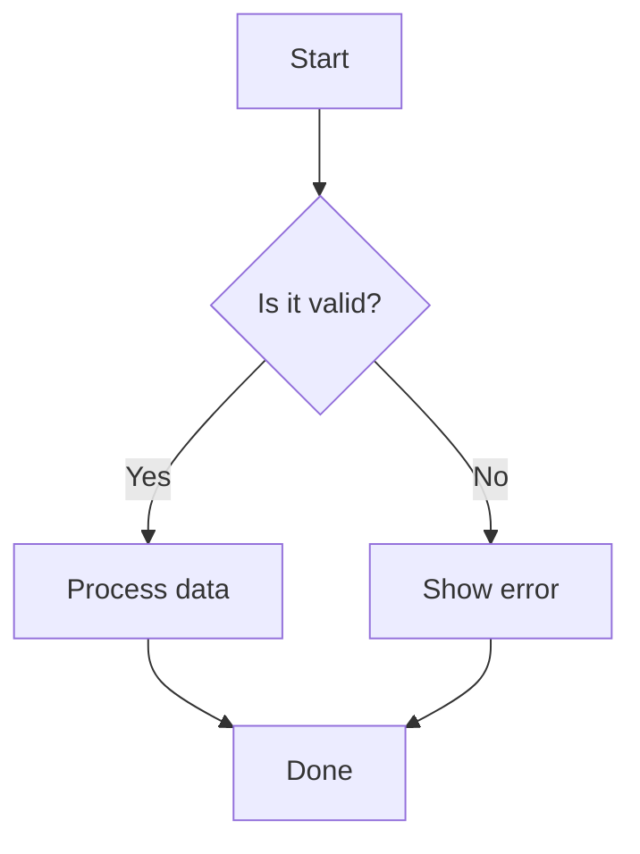

[](https://docs.mhaibaraai.cn/)
[](https://docs.mhaibaraai.cn/)

[](./README.md)

> A modern Nuxt 4 documentation theme with auto-generated component docs, an AI chat assistant, MCP Server, and a complete developer experience.

[](https://docs.mhaibaraai.cn/mcp/deeplink)
[](https://docs.mhaibaraai.cn/mcp/deeplink?ide=vscode)

[![npm version][npm-version-src]][npm-version-href]
[![npm downloads][npm-downloads-src]][npm-downloads-href]
[![License][license-src]][license-href]
[![Nuxt][nuxt-src]][nuxt-href]

Use this theme to quickly build polished, professional, and intelligent documentation sites. It includes auto-generated component docs, an AI chat assistant, MCP Server support, SEO optimization, dark mode, full-text search, and more.

- [Online documentation](https://docs.mhaibaraai.cn/)

## Features

This theme brings together a focused set of capabilities for a better documentation workflow.

### AI-enhanced experience

<div style="padding: 40px 0; display: flex; justify-content: center;">

</div>

- **AI chat assistant** - Built-in documentation assistant powered by the Vercel AI SDK, with support for multiple LLM providers.
- **MCP Server support** - Integrated Model Context Protocol server that gives AI assistants structured access to your documentation.
- **LLM optimization** - Automatically generates `llms.txt` and `llms-full.txt` through `nuxt-llms`, providing optimized documentation indexes for AI tools.
- **Streaming responses** - Supports streaming AI responses and code highlighting, with real-time syntax highlighting through `shiki-stream`.

### AI agent skills

Agent Skills are an open format that lets AI agents such as Claude Code, Cursor, and Windsurf discover and load site-specific workflows. Movk Nuxt Docs automatically publishes every skill in the `skills/` directory through `/.well-known/skills/` endpoints.

**Built-in skills:**

- `create-docs` - Generate a complete documentation site based on Movk Nuxt Docs for any project.
- `review-docs` - Review documentation quality, clarity, SEO, and technical correctness.

**Install into AI tools with one command:**

```bash
npx skills add https://docs.mhaibaraai.cn
```

See the [Agent Skills documentation](https://docs.mhaibaraai.cn/docs/getting-started/skills) for details.

### Automated documentation

- **Automatic component metadata extraction** - Extract Vue component props, slots, and emits with `nuxt-component-meta`.
- **Interactive examples** - Use the `ComponentExample` component to load and render examples with code highlighting and live previews.
- **Git commit history integration** - Use `CommitChangelog` and `PageLastCommit` to show commit history for documentation files.
- **Type definition highlighting** - Parse TypeScript type definitions intelligently, with inline type highlighting and type navigation.

### Developer experience

- **Built on Nuxt 4** - Uses the latest Nuxt framework for strong performance and modern conventions.
- **Powered by Nuxt UI** - Ships with a comprehensive UI component library.
- **Enhanced MDC syntax** - Combines Markdown and Vue components seamlessly.
- **Mermaid diagrams** - Optional on-demand diagrams for flowcharts, sequence diagrams, class diagrams, and more, with automatic theme switching and fullscreen viewing.
- **Full-text search** - Uses Nuxt Content's `ContentSearch` component and supports the Cmd+K keyboard shortcut.
- **Dark mode** - Supports light and dark themes.
- **Responsive design** - Mobile-first responsive layout.
- **SEO optimization** - Built-in SEO features.
- **TypeScript support** - Complete TypeScript support.

## Quick Start

### Create a project from a template

Choose the template that fits your use case.

#### Full documentation site

Best for complete documentation sites. Includes development tooling such as ESLint and TypeScript checks.

```bash
# Create a new project with the full template
npx nuxi init -t gh:mhaibaraai/movk-nuxt-docs/templates/default my-docs
cd my-docs
pnpm dev
```

#### Module documentation site

Best for quickly documenting npm packages or libraries. Includes release pages for version history and keeps extra development tooling minimal.

```bash
# Create a new project with the module template
npx nuxi init -t gh:mhaibaraai/movk-nuxt-docs/templates/module my-module-docs
cd my-module-docs
pnpm dev
```

Visit `http://localhost:3000` to view your documentation site.

### Use as a layer

Use Movk Nuxt Docs as a layer in an existing Nuxt project:

```bash [Terminal]
pnpm add @movk/nuxt-docs better-sqlite3 tailwindcss
```

Configure it in `nuxt.config.ts`:

```ts [nuxt.config.ts]
export default defineNuxtConfig({
+  extends: ['@movk/nuxt-docs']
})
```

## Project Structure

### Template project structure

A project created from a template looks like this, using the `default` template as an example:

```bash
my-docs/
|-- app/
|   `-- composables/             # Custom composables
|-- content/                     # Markdown content
|   |-- index.md                 # Home page
|   `-- docs/                    # Documentation pages
|-- public/                      # Static assets
|-- nuxt.config.ts               # Nuxt configuration
|-- tsconfig.json                # TypeScript configuration
|-- package.json                 # Dependencies and scripts
|-- .env.example                 # Environment variable examples
`-- pnpm-workspace.yaml          # pnpm workspace configuration
```

### Monorepo structure

This repository uses a monorepo structure:

```bash
movk-nuxt-docs/
|-- docs/                        # Official documentation site
|-- layer/                       # @movk/nuxt-docs layer package
|-- templates/
|   |-- default/                 # Full documentation site template
|   `-- module/                  # Module documentation site template
`-- scripts/                     # Build scripts
```

## Writing Content

### Basic Markdown

```md [md]
---
title: Page title
description: Page description
---

# Heading

This is a normal text paragraph.

## Secondary heading

- List item 1
- List item 2
```

### MDC syntax

```md [md]
::card
---
title: Card title
icon: i-lucide-rocket
---
Card content
::
```

Learn more about MDC syntax in the [Nuxt Content documentation](https://content.nuxt.com/docs/files/markdown#mdc-syntax).

### Mermaid diagrams

Mermaid is optional and disabled by default. Install the dependencies first, then enable it in configuration:

```bash
pnpm add mermaid dompurify
```

```ts [nuxt.config.ts]
export default defineNuxtConfig({
  extends: ['@movk/nuxt-docs'],

  movkNuxtDocs: {
    mermaid: true
  }
})
```

After enabling Mermaid, use ` ```mermaid ` code blocks to render diagrams such as flowcharts, sequence diagrams, and class diagrams:

````md [md]

````

**Main features:**

- Automatic theme switching for light and dark modes.
- Lazy loading, rendering diagrams only when visible.
- One-click copying for diagram source code.
- Fullscreen viewing.
- Secure rendering with DOMPurify sanitization.

**Supported diagram types:**

- **Flowcharts** (`flowchart`/`graph`) - Show processes and decisions.


- **Sequence diagrams** (`sequenceDiagram`) - Show interaction sequences.


- **Class diagrams** (`classDiagram`) - Show class relationships.
- **State diagrams** (`stateDiagram`) - Show state transitions.
- **Gantt charts** (`gantt`) - Show project timelines.
- **Pie charts** (`pie`) - Show proportions.
- **Git graphs** (`gitGraph`) - Show branch history.
- And more [diagram types supported by Mermaid](https://mermaid.js.org/intro/).

### Accessibility support

Movk Nuxt Docs enables `@nuxt/a11y` by default. To disable it, set the following option in `movkNuxtDocs`:

```ts [nuxt.config.ts]
export default defineNuxtConfig({
  extends: ['@movk/nuxt-docs'],

  movkNuxtDocs: {
    a11y: false
  }
})
```

## Development

### Local development

```bash [Terminal]
# Clone the repository
git clone https://github.com/mhaibaraai/movk-nuxt-docs.git
# Enter the project directory
cd movk-nuxt-docs
# Install dependencies
pnpm install
# Start the development server
pnpm dev
```

The development server starts at `http://localhost:3000`.

### Production build

```bash [Terminal]
# Build the app
pnpm build
# Preview the production build locally
pnpm preview
```

### Release

```bash [Terminal]
# Release the layer to npm
pnpm release:layer
# Release the full project
pnpm release
```

## Tech Stack

This project is built on the following open-source projects.

### Core framework

- [Nuxt 4](https://nuxt.com/) - Web framework.
- [Nuxt Content](https://content.nuxt.com/) - File-based CMS.
- [Nuxt UI](https://ui.nuxt.com/) - UI component library.
- [Tailwind CSS 4](https://tailwindcss.com/) - CSS framework.

### AI integration

- [Vercel AI SDK](https://sdk.vercel.ai/) - AI integration framework.
- [Nuxt LLMs](https://github.com/nuxt-content/nuxt-llms) - LLM optimization.
- [@nuxtjs/mcp-toolkit](https://github.com/nuxt-modules/mcp-toolkit) - MCP Server support.
- [Shiki](https://shiki.style/) - Code syntax highlighting.
- [Shiki Stream](https://github.com/antfu/shiki-stream) - Streaming code highlighting.

### Enhancements

- [Nuxt Component Meta](https://github.com/nuxt-content/nuxt-component-meta) - Component metadata extraction.
- [Nuxt Image](https://image.nuxt.com/) - Image optimization.
- [Nuxt SEO](https://nuxtseo.com/) - SEO optimization.
- [Octokit](https://github.com/octokit/rest.js) - GitHub API integration.

## Documentation

Visit the [Movk Nuxt Docs documentation](https://docs.mhaibaraai.cn/) for detailed guides and API documentation.

## Credits

This project is built on or inspired by the following projects:

- [Docus](https://docus.dev/) - A documentation theme developed by the Nuxt Content team.
- [Nuxt UI Docs Template](https://docs-template.nuxt.dev/) - The official Nuxt UI documentation template.

## License

[MIT](./LICENSE) License (c) 2024-PRESENT [YiXuan](https://github.com/mhaibaraai)


<!-- Badges -->

[npm-version-src]: https://img.shields.io/npm/v/@movk/nuxt-docs/latest.svg?style=flat&colorA=020420&colorB=00DC82
[npm-version-href]: https://npmjs.com/package/@movk/nuxt-docs
[npm-downloads-src]: https://img.shields.io/npm/dm/@movk/nuxt-docs.svg?style=flat&colorA=020420&colorB=00DC82
[npm-downloads-href]: https://npm.chart.dev/@movk/nuxt-docs
[license-src]: https://img.shields.io/badge/License-MIT-blue.svg
[license-href]: https://npmjs.com/package/@movk/nuxt-docs
[nuxt-src]: https://img.shields.io/badge/Nuxt-4-00DC82?logo=nuxt.js&logoColor=fff
[nuxt-href]: https://nuxt.com
