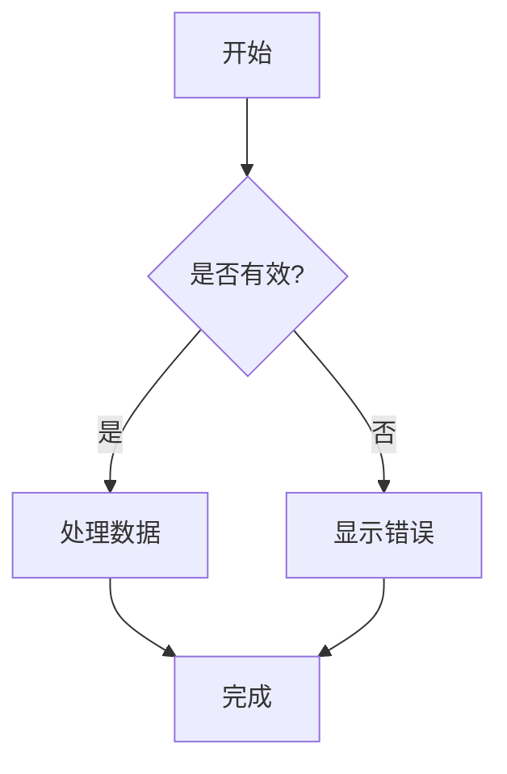

[](https://docs.mhaibaraai.cn/)
[](https://docs.mhaibaraai.cn/)

> 基于 Nuxt 4 的现代文档主题，集成组件自动化文档、AI 聊天助手、MCP Server 和完整的开发者体验优化

[](https://docs.mhaibaraai.cn/mcp/deeplink)
[](https://docs.mhaibaraai.cn/mcp/deeplink?ide=vscode)

[![npm version][npm-version-src]][npm-version-href]
[![npm downloads][npm-downloads-src]][npm-downloads-href]
[![License][license-src]][license-href]
[![Nuxt][nuxt-src]][nuxt-href]

使用此主题可以快速构建美观、专业、智能的文档网站，内置组件文档自动生成、AI 聊天助手、MCP Server 支持、SEO 优化、暗黑模式、全文搜索等功能。

- 📖 [在线文档](https://docs.mhaibaraai.cn/)

## ✨ 特性

此主题集成了一系列旨在优化文档管理体验的强大功能：

### 🤖 AI 增强体验

<div style="padding: 40px 0; display: flex; justify-content: center;">

</div>

- **AI 聊天助手** - 内置智能文档助手，基于 Vercel AI SDK 支持多种 LLM 模型
- **MCP Server 支持** - 集成 Model Context Protocol 服务器，为 AI 助手提供结构化的文档访问能力
- **LLM 优化** - 通过 `nuxt-llms` 模块自动生成 `llms.txt` 和 `llms-full.txt`，为 AI 工具提供优化的文档索引
- **流式响应** - 支持 AI 响应流式输出和代码高亮，配合 `shiki-stream` 实现实时语法高亮渲染

### AI 助手 Skill

Agent Skills 是一种开放格式，允许 AI 代理（Claude Code、Cursor、Windsurf 等）自动发现并加载文档站的专属工作流。Movk Nuxt Docs 将 `skills/` 目录下的所有技能自动发布到 `/.well-known/skills/` 端点。

**内置技能：**

- `create-docs` - 为任意项目生成基于 Movk Nuxt Docs 的完整文档网站
- `review-docs` - 审查文档质量，检查清晰度、SEO 和技术正确性

**一键安装到 AI 工具：**

```bash
npx skills add https://docs.mhaibaraai.cn
```

详见 [Agent Skills 文档](https://docs.mhaibaraai.cn/docs/getting-started/skills)。

### 🧩 自动化文档生成

- **组件元数据自动提取** - 基于 `nuxt-component-meta` 自动提取 Vue 组件的 Props、Slots、Emits 定义
- **交互式示例展示** - 通过 `ComponentExample` 组件自动加载和渲染组件示例，支持代码高亮和实时预览
- **Git 提交历史集成** - 使用 `CommitChangelog` 和 `PageLastCommit` 组件自动展示文件的提交历史记录
- **类型定义高亮** - 智能解析 TypeScript 类型定义，支持内联类型高亮和类型导航

### 🎨 开发者体验

- ⚡ **基于 Nuxt 4** - 充分利用最新的 Nuxt 框架，实现卓越性能
- 🎨 **采用 Nuxt UI** - 集成全面的 UI 组件库，开箱即用
- 📝 **MDC 语法增强** - 支持 Markdown 与 Vue 组件的无缝集成
- 📊 **Mermaid 图表** - 可选按需启用，渲染流程图、时序图、类图等可视化图表，支持自动主题切换和全屏查看
- 🔍 **全文搜索** - 基于 Nuxt Content 的 `ContentSearch` 组件，支持键盘快捷键（⌘K）
- 🌙 **暗黑模式** - 支持亮色/暗色主题切换
- 📱 **响应式设计** - 移动优先的响应式布局
- 🚀 **SEO 优化** - 内置 SEO 优化功能
- 🎯 **TypeScript 支持** - 完整的 TypeScript 类型支持

## 🚀 快速开始

### 使用模板创建项目

根据您的需求选择合适的模板：

#### 📚 完整文档站点（推荐）

适合构建完整的文档网站，包含 ESLint、TypeScript 检查等开发工具。

```bash
# 使用完整模板创建新项目
npx nuxi init -t gh:mhaibaraai/movk-nuxt-docs/templates/default my-docs
cd my-docs
pnpm dev
```

#### 📦 模块文档站点（精简）

适合为 npm 包或库快速创建文档，内置 Release 页面展示版本发布历史，无额外开发工具。

```bash
# 使用模块模板创建新项目
npx nuxi init -t gh:mhaibaraai/movk-nuxt-docs/templates/module my-module-docs
cd my-module-docs
pnpm dev
```

访问 `http://localhost:3000` 查看你的文档网站。

### 作为 Layer 使用

在现有 Nuxt 项目中使用 Movk Nuxt Docs 作为 layer：

```bash [Terminal]
pnpm add @movk/nuxt-docs better-sqlite3 tailwindcss
```

在 `nuxt.config.ts` 中配置：

```ts [nuxt.config.ts]
export default defineNuxtConfig({
+  extends: ['@movk/nuxt-docs']
})
```

## 📁 项目结构

### 模板项目结构

使用模板创建的项目结构（以 `default` 模板为例）：

```bash
my-docs/
├── app/
│   └── composables/             # 自定义 Composables
├── content/                     # Markdown 内容
│   ├── index.md                 # 首页
│   └── docs/                    # 文档页面
├── public/                      # 静态资源
├── nuxt.config.ts               # Nuxt 配置
├── tsconfig.json                # TypeScript 配置
├── package.json                 # 依赖与脚本
├── .env.example                # 环境变量示例
└── pnpm-workspace.yaml          # pnpm 工作区配置
```

### Monorepo 结构

本仓库采用 monorepo 结构：

```bash
movk-nuxt-docs/
├── docs/                        # 官方文档站点
├── layer/                       # @movk/nuxt-docs layer 包
├── templates/
│   ├── default/                 # 完整文档站点模板
│   └── module/                  # 模块文档站点模板（精简）
└── scripts/                     # 构建脚本
```

## 📝 内容编写

### 基础 Markdown

```md [md]
---
title: 页面标题
description: 页面描述
---

# 标题

这是一段普通的文本内容。

## 二级标题

- 列表项 1
- 列表项 2
```

### MDC 语法

```md [md]
::card
---
title: 卡片标题
icon: i-lucide-rocket
---
卡片内容
::
```

了解更多关于 MDC 语法，请查看 [Nuxt Content 文档](https://content.nuxt.com/docs/files/markdown#mdc-syntax)。

### Mermaid 图表

Mermaid 是可选功能，默认不启用。先安装依赖，再开启配置：

```bash
pnpm add mermaid dompurify
```

```ts [nuxt.config.ts]
export default defineNuxtConfig({
  extends: ['@movk/nuxt-docs'],

  movkNuxtDocs: {
    mermaid: true
  }
})
```

启用后，使用 ` ```mermaid ` 代码块渲染可视化图表，支持流程图、时序图、类图等多种图表类型：

````md [md]

````

**主要特性：**
- 🎨 自动主题切换（深色/浅色模式）
- 🔄 懒加载（仅在可见时渲染）
- 📋 一键复制图表代码
- 🖼️ 全屏查看功能
- 🔒 安全渲染（DOMPurify 清理）

**支持的图表类型：**
- **流程图**（`flowchart`/`graph`）：用于展示流程和决策

- **时序图**（`sequenceDiagram`）：用于展示交互时序

- **类图**（`classDiagram`）：用于展示类关系
- **状态图**（`stateDiagram`）：用于展示状态转换
- **甘特图**（`gantt`）：用于展示项目时间线
- **饼图**（`pie`）：用于展示数据占比
- **Git 图**（`gitGraph`）：用于展示分支历史
- 以及更多 [Mermaid 支持的图表类型](https://mermaid.js.org/intro())

### 无障碍支持（A11y）

Movk Nuxt Docs 默认启用 `@nuxt/a11y`。如需关闭，可在 `movkNuxtDocs` 中设置：

```ts [nuxt.config.ts]
export default defineNuxtConfig({
  extends: ['@movk/nuxt-docs'],

  movkNuxtDocs: {
    a11y: false
  }
})
```

## 🛠️ 开发

### 本地开发

```bash [Terminal]
# 克隆项目
git clone https://github.com/mhaibaraai/movk-nuxt-docs.git
# 进入项目目录
cd movk-nuxt-docs
# 安装依赖
pnpm install
# 启动开发服务器
pnpm dev
```

开发服务器将在 `http://localhost:3000` 启动。

### 构建生产版本

```bash [Terminal]
# 构建应用
pnpm build
# 本地预览生产构建
pnpm preview
```

### 发布

```bash [Terminal]
# 发布 layer 到 npm
pnpm release:layer
# 发布完整项目
pnpm release
```

## ⚡ 技术栈

本项目基于以下优秀的开源项目构建：

### 核心框架

- [Nuxt 4](https://nuxt.com/) - Web 框架
- [Nuxt Content](https://content.nuxt.com/) - 基于文件的 CMS
- [Nuxt UI](https://ui.nuxt.com/) - UI 组件库
- [Tailwind CSS 4](https://tailwindcss.com/) - CSS 框架

### AI 集成

- [Vercel AI SDK](https://sdk.vercel.ai/) - AI 集成框架
- [Nuxt LLMs](https://github.com/nuxt-content/nuxt-llms) - LLM 优化
- [@nuxtjs/mcp-toolkit](https://github.com/nuxt-modules/mcp-toolkit) - MCP Server 支持
- [Shiki](https://shiki.style/) - 代码语法高亮
- [Shiki Stream](https://github.com/antfu/shiki-stream) - 流式代码高亮

### 功能增强

- [Nuxt Component Meta](https://github.com/nuxt-content/nuxt-component-meta) - 组件元数据提取
- [Nuxt Image](https://image.nuxt.com/) - 图片优化
- [Nuxt SEO](https://nuxtseo.com/) - SEO 优化
- [Octokit](https://github.com/octokit/rest.js) - GitHub API 集成

## 📖 文档

访问 [Movk Nuxt Docs 文档](https://docs.mhaibaraai.cn/) 了解详细的使用指南和 API 文档。

## 🙏 致谢

本项目基于以下优秀项目构建或受其启发：

- [Docus](https://docus.dev/) - 由 Nuxt Content 团队开发的文档主题
- [Nuxt UI Docs Template](https://docs-template.nuxt.dev/) - Nuxt UI 官方文档模板

## 📄 许可证

[MIT](./LICENSE) License © 2024-PRESENT [YiXuan](https://github.com/mhaibaraai)


<!-- Badges -->

[npm-version-src]: https://img.shields.io/npm/v/@movk/nuxt-docs/latest.svg?style=flat&colorA=020420&colorB=00DC82
[npm-version-href]: https://npmjs.com/package/@movk/nuxt-docs
[npm-downloads-src]: https://img.shields.io/npm/dm/@movk/nuxt-docs.svg?style=flat&colorA=020420&colorB=00DC82
[npm-downloads-href]: https://npm.chart.dev/@movk/nuxt-docs
[license-src]: https://img.shields.io/badge/License-MIT-blue.svg
[license-href]: https://npmjs.com/package/@movk/nuxt-docs
[nuxt-src]: https://img.shields.io/badge/Nuxt-4-00DC82?logo=nuxt.js&logoColor=fff
[nuxt-href]: https://nuxt.com
