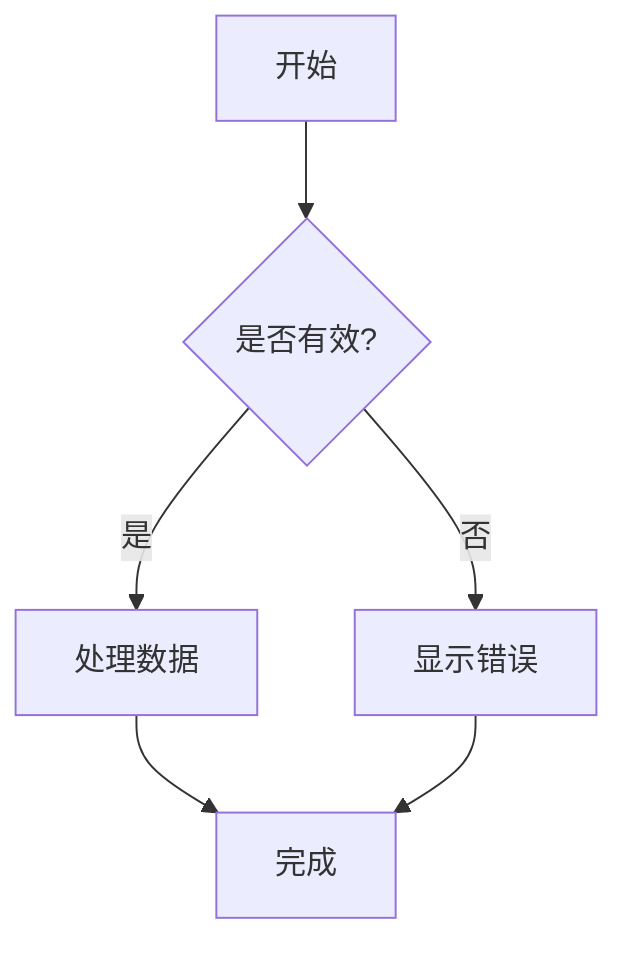
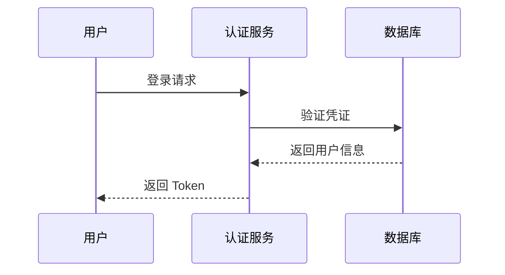
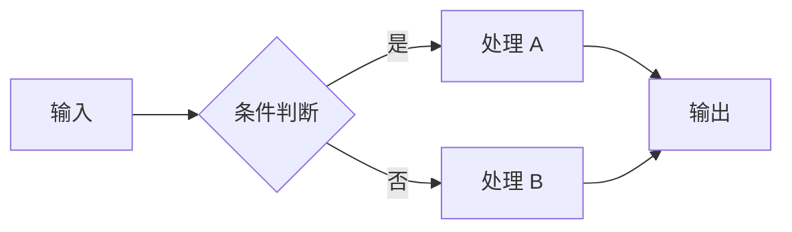
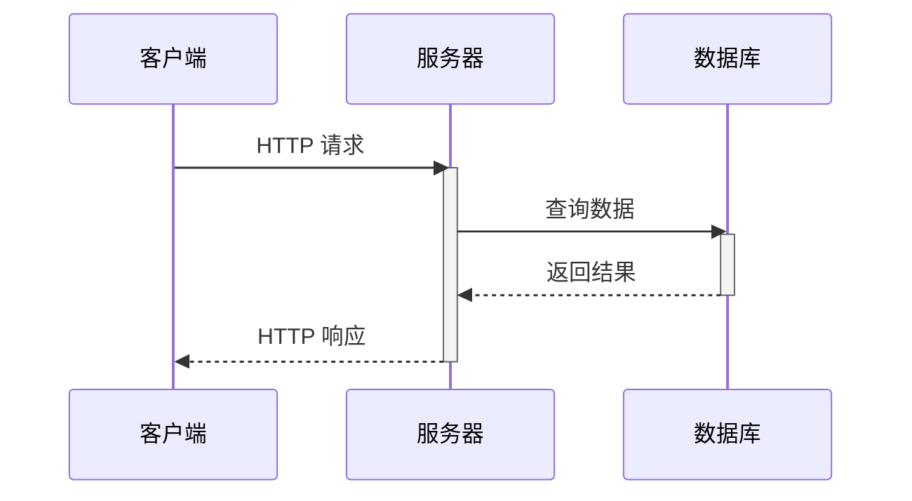
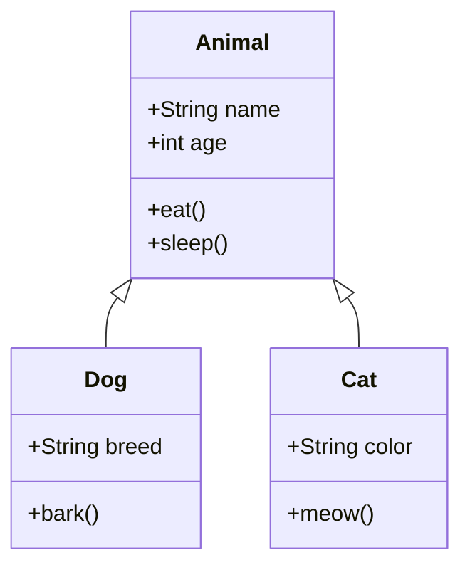
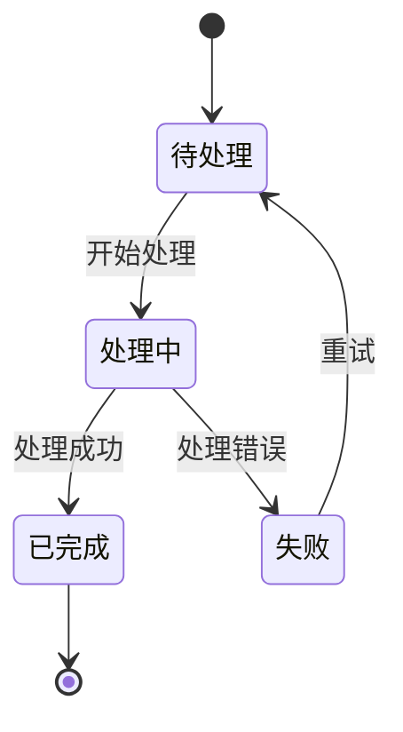
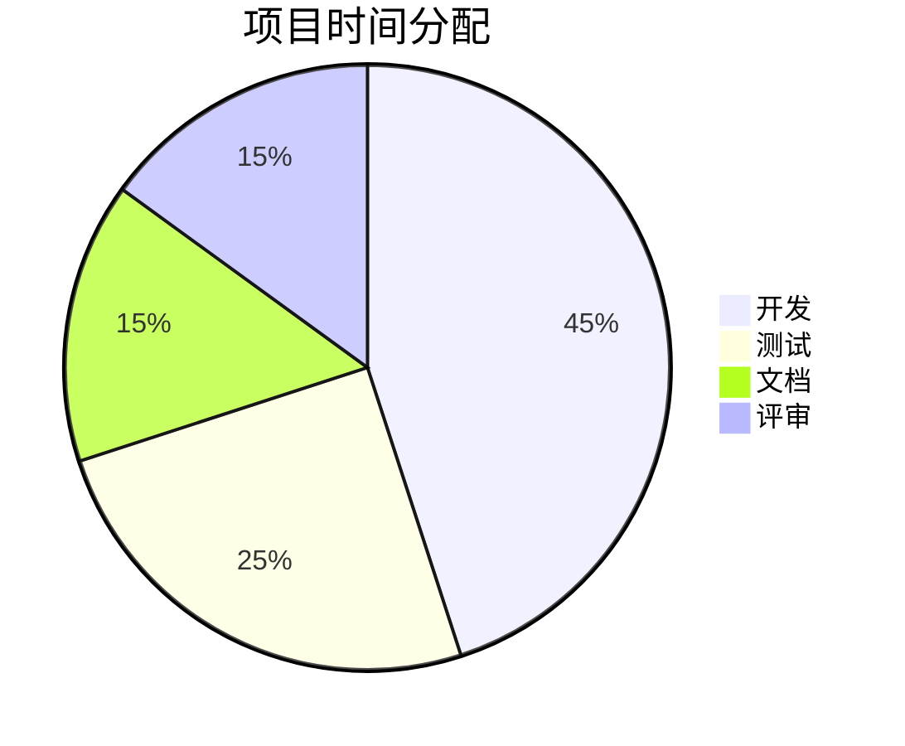
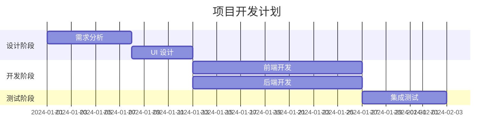
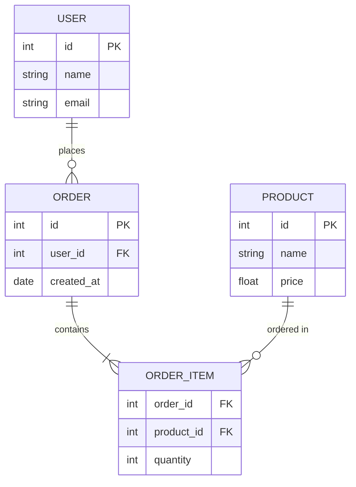

## 基础用法

使用 ` ```mermaid ` 代码块渲染图表。支持自动主题切换（深色/浅色模式）、懒加载、复制代码和全屏查看功能。

::code-preview
---
class: "[&>div]:*:my-0 [&>div]:*:w-full"
---


#code
````md

````
::

### 带文件名的图表

与代码块类似，可以在方括号中指定文件名，显示在图表顶部：

::code-preview
---
class: "[&>div]:*:my-0 [&>div]:*:w-full"
---


#code
````md
```mermaid [auth-flow.mmd]
sequenceDiagram
    participant U as 用户
    participant A as 认证服务
    ...
```
````
::

## 图表类型

### 流程图

使用 `flowchart` 或 `graph` 定义流程图。支持方向：`TB`（上到下）、`LR`（左到右）、`BT`、`RL`。



### 时序图

使用 `sequenceDiagram` 展示对象间的交互顺序：



### 类图

使用 `classDiagram` 展示类的结构和关系：



### 状态图

使用 `stateDiagram-v2` 展示状态机：



### 饼图

使用 `pie` 展示数据占比：



### 甘特图

使用 `gantt` 展示项目计划：



### 实体关系图

使用 `erDiagram` 展示数据库关系：



::tip{to="https://mermaid.js.org/intro/"}
查看 Mermaid 官方文档了解更多图表类型和语法。
::

## 自定义样式

在 `app.config.ts` 中自定义 Mermaid 组件样式：

```ts [app.config.ts]
export default defineAppConfig({
  ui: {
    prose: {
      mermaid: {
        slots: {
          root: 'border-2 border-primary rounded-lg',
          header: 'bg-primary/10',
          diagram: 'bg-muted/50 p-6',
          toolbar: 'top-3 right-3',
          loading: 'text-primary',
          error: 'bg-error/20'
        }
      }
    }
  }
})
```

## API

### Props

:component-props

## Theme

::code-collapse

```ts [app.config.ts]
export default defineAppConfig({
  ui: {
    prose: {
      mermaid: {
        slots: {
          root: 'relative my-5 group border border-muted rounded-md overflow-hidden',
          header: 'flex items-center gap-1.5 border-b border-muted bg-default px-4 py-3',
          filename: 'text-default text-sm/6',
          icon: 'size-4 shrink-0',
          toolbar: 'absolute top-2 right-2 flex gap-1 z-10 opacity-0 group-hover:opacity-100 transition-opacity',
          diagram: 'p-4 flex justify-center bg-elevated overflow-x-auto',
          loading: 'p-4 flex items-center justify-center gap-2 text-sm text-muted',
          error: 'p-4 flex items-center justify-center gap-2 text-sm text-error bg-error/10'
        },
        variants: {
          fullscreen: {
            true: {
              root: 'fixed inset-0 z-50 m-0 rounded-none bg-default flex flex-col',
              diagram: 'flex-1 overflow-auto',
              toolbar: 'opacity-100'
            }
          },
          filename: {
            true: {
              root: ''
            }
          }
        }
      }
    }
  }
})
```
::

## Changelog

:commit-changelog
