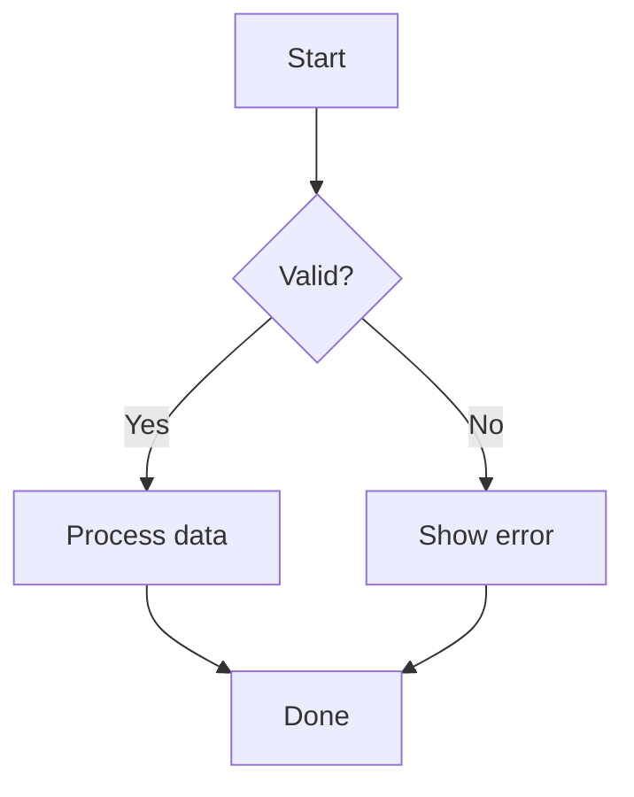
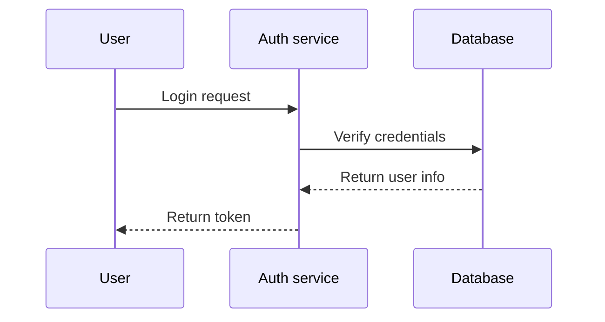
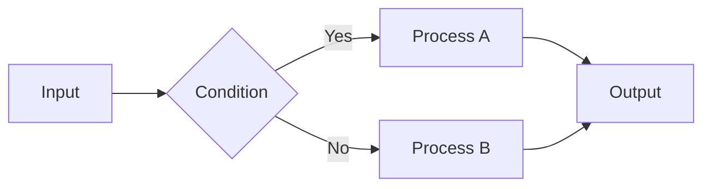
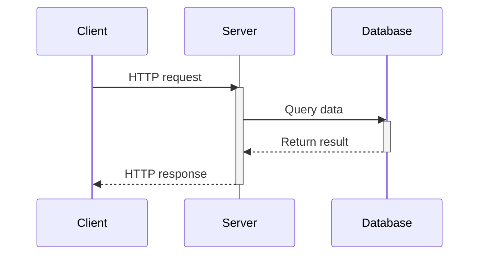
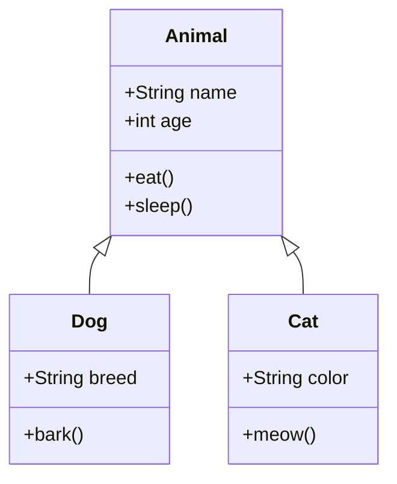
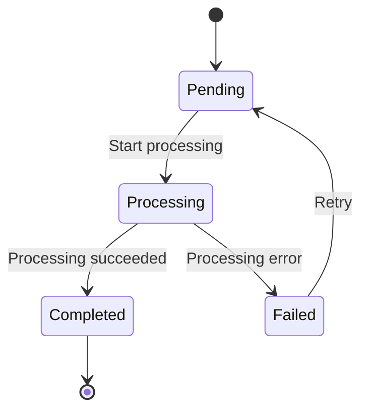
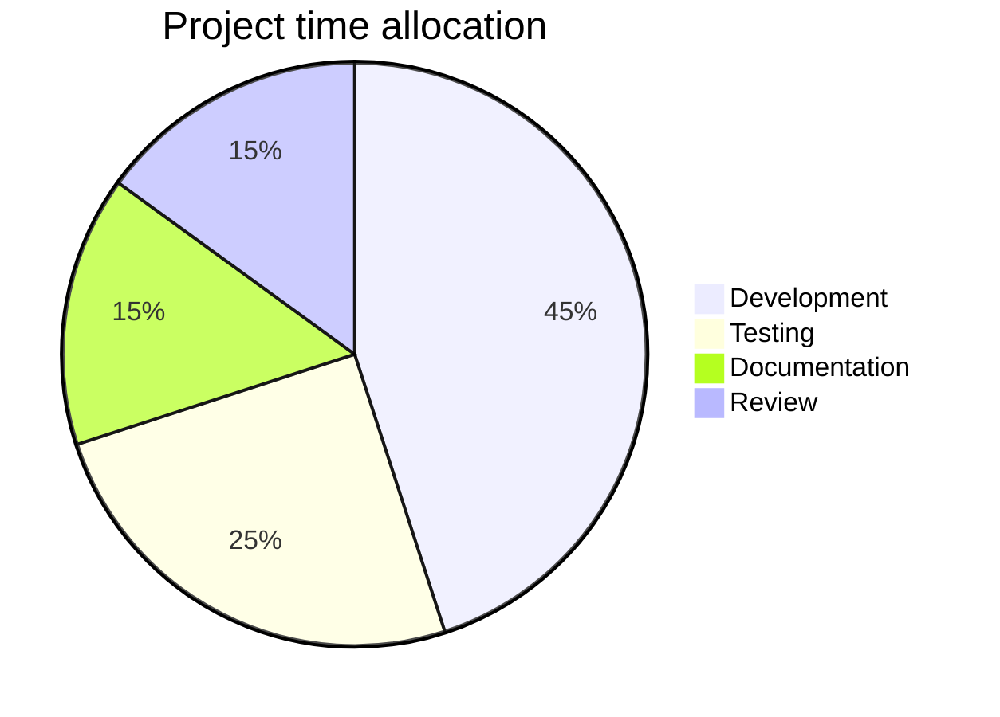
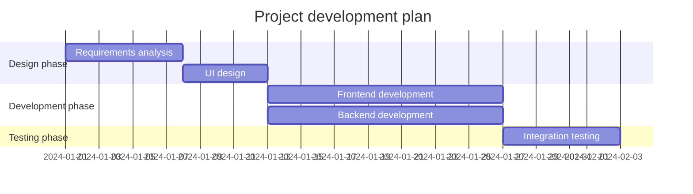
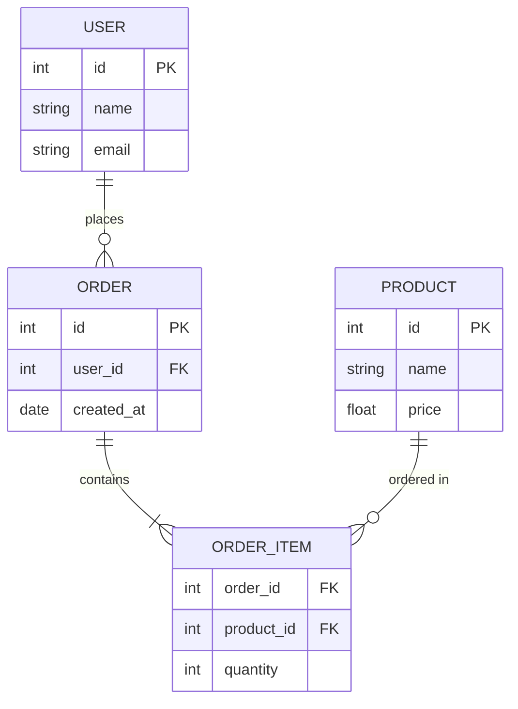

## Enabling Mermaid support

Mermaid is an optional feature, disabled by default. Before enabling it, install the dependencies first, then turn it on in the configuration.

::steps{level="3"}
### Install the dependencies

  ::code-group
  ```bash [pnpm]
  pnpm add mermaid dompurify
  ```

  ```bash [npm]
  npm install mermaid dompurify
  ```

  ```bash [yarn]
  yarn add mermaid dompurify
  ```

  ```bash [bun]
  bun add mermaid dompurify
  ```
  ::

### Enable the configuration

```ts [nuxt.config.ts]
export default defineNuxtConfig({
  extends: ['@movk/nuxt-docs'],

  movkNuxtDocs: {
    mermaid: true
  }
})
```
::

::tip
If you enable it without installing the dependencies, the module prints a warning and skips registration, and `mermaid` code blocks fall back to being displayed as plain code blocks.
::

## Basic usage

Use a ` ```mermaid ` code block to render a diagram. It supports automatic theme switching (dark/light mode), lazy loading, copying code, and full-screen viewing.

::code-preview
---
class: "[&>div]:*:my-0 [&>div]:*:w-full"
---


#code
````md

````
::

### Diagrams with a filename

Similar to code blocks, you can specify a filename in square brackets to display it at the top of the diagram:

::code-preview
---
class: "[&>div]:*:my-0 [&>div]:*:w-full"
---


#code
````md
```mermaid [auth-flow.mmd]
sequenceDiagram
participant U as User
participant A as Auth service
...
```
````
::

## Diagram types

### Flowchart

Use `flowchart` or `graph` to define a flowchart. Supported directions: `TB` (top to bottom), `LR` (left to right), `BT`, `RL`.



### Sequence diagram

Use `sequenceDiagram` to show the order of interactions between objects:



### Class diagram

Use `classDiagram` to show the structure and relationships of classes:



### State diagram

Use `stateDiagram-v2` to show a state machine:



### Pie chart

Use `pie` to show data proportions:



### Gantt chart

Use `gantt` to show a project schedule:



### Entity-relationship diagram

Use `erDiagram` to show database relationships:



::tip{to="https://mermaid.js.org/intro/"}
See the official Mermaid documentation for more diagram types and syntax.
::

## Custom styling

Customize the Mermaid component styles in `app/app.config.ts`:

```ts [app/app.config.ts]
export default defineAppConfig({
  ui: {
    prose: {
      mermaid: {
        slots: {
          root: 'border-2 border-primary rounded-lg',
          header: 'bg-primary/10',
          diagram: 'bg-muted/50 p-6',
          toolbar: 'top-3 right-3',
          loading: 'text-primary',
          error: 'bg-error/20'
        }
      }
    }
  }
})
```

## API

### Props

:component-props{prose name="Mermaid"}

## Theme

::code-collapse

```ts [app/app.config.ts]
export default defineAppConfig({
  ui: {
    prose: {
      mermaid: {
        slots: {
          root: 'relative my-5 group border border-muted rounded-md overflow-hidden',
          header: 'flex items-center gap-1.5 border-b border-muted bg-default px-4 py-3',
          filename: 'text-default text-sm/6',
          icon: 'size-4 shrink-0',
          toolbar: 'absolute top-2 right-2 flex gap-1 z-10 opacity-0 group-hover:opacity-100 transition-opacity',
          diagram: 'p-4 flex justify-center bg-elevated overflow-x-auto',
          loading: 'p-4 flex items-center justify-center gap-2 text-sm text-muted',
          error: 'p-4 flex items-center justify-center gap-2 text-sm text-error bg-error/10'
        },
        variants: {
          fullscreen: {
            true: {
              root: 'fixed inset-0 z-50 m-0 rounded-none bg-default flex flex-col',
              diagram: 'flex-1 overflow-auto',
              toolbar: 'opacity-100'
            }
          },
          filename: {
            true: {
              root: ''
            }
          }
        }
      }
    }
  }
})
```
::

## Changelog

:commit-changelog{commitPath="layer/modules/runtime/components/prose"}
