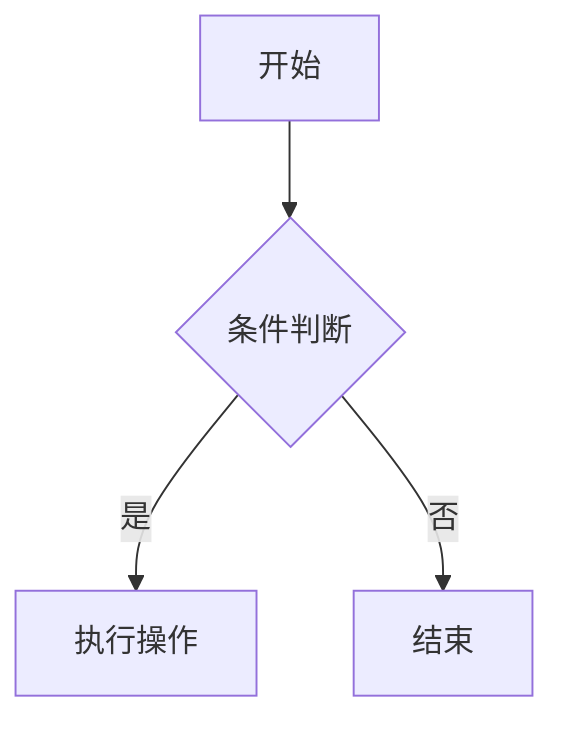

# MDC 组件参考

Movk Nuxt Docs 使用带有 MDC 语法的 Nuxt UI 组件。

**关键：在 MDC 中始终对 Nuxt UI 组件使用 `u-` 前缀：**

```markdown
::u-page-hero      ✅ 正确（解析为 UPageHero）
::page-hero        ❌ 错误（无法解析）
```

---

## 文档源

**组件：**
- 组件列表：https://ui.nuxt.com/llms.txt
- 原始文档：`https://ui.nuxt.com/raw/docs/components/[component].md`

**排版/Prose：**
- 介绍：https://ui.nuxt.com/raw/docs/typography.md
- 标题和文本：https://ui.nuxt.com/raw/docs/typography/headers-and-text.md
- 列表和表格：https://ui.nuxt.com/raw/docs/typography/lists-and-tables.md
- 代码块：https://ui.nuxt.com/raw/docs/typography/code-blocks.md
- 标注：https://ui.nuxt.com/raw/docs/typography/callouts.md
- 手风琴：https://ui.nuxt.com/raw/docs/typography/accordion.md
- 选项卡：https://ui.nuxt.com/raw/docs/typography/tabs.md

---

## 页面布局组件

文档网站最常用的组件：

| 组件 | 原始文档 | 用途 |
|-----------|----------|---------|
| `u-page-hero` | [page-hero.md](https://ui.nuxt.com/raw/docs/components/page-hero.md) | 登陆页视图 |
| `u-page-section` | [page-section.md](https://ui.nuxt.com/raw/docs/components/page-section.md) | 内容部分 |
| `u-page-grid` | [page-grid.md](https://ui.nuxt.com/raw/docs/components/page-grid.md) | 响应式网格布局 |
| `u-page-card` | [page-card.md](https://ui.nuxt.com/raw/docs/components/page-card.md) | 富内容卡片 |
| `u-page-feature` | [page-feature.md](https://ui.nuxt.com/raw/docs/components/page-feature.md) | 功能展示 |
| `u-page-cta` | [page-cta.md](https://ui.nuxt.com/raw/docs/components/page-cta.md) | 行动号召 |
| `u-page-header` | [page-header.md](https://ui.nuxt.com/raw/docs/components/page-header.md) | 页面标题 |

---

## 快速语法示例

### 带按钮的登陆页视图

```markdown
::u-page-hero
#title
项目名称

#description
简短描述

#headline
  :::u-button{size="sm" to="/changelog" variant="outline"}
  v1.0.0 →
  :::

#links
  :::u-button{color="neutral" size="xl" to="/getting-started" trailing-icon="i-lucide-arrow-right"}
  开始使用
  :::

  :::u-button{color="neutral" size="xl" to="https://github.com/..." target="_blank" variant="outline" icon="i-simple-icons-github"}
  GitHub
  :::
::
```

### 包含卡片的网格

```markdown
::u-page-section
  :::u-page-grid
    ::::u-page-card{spotlight class="col-span-2 lg:col-span-1" to="/feature"}
    #title
    功能标题

    #description
    功能描述
    ::::

    ::::u-page-card{spotlight class="col-span-2"}
      :::::u-color-mode-image{alt="截图" class="w-full rounded-lg" dark="/images/dark.png" light="/images/light.png"}
      :::::

    #title
    视觉功能

    #description
    带有浅色/深色模式图像
    ::::
  :::
::
```

### 包含代码块的卡片

```markdown
::::u-page-card{spotlight class="col-span-2 md:col-span-1"}
  :::::div{.bg-elevated.rounded-lg.p-3}
  ```ts [config.ts]
  export default {
    option: 'value'
  }
  ```
  :::::

#title
配置

#description
易于配置
::::
```

---

## 内容组件

| 组件 | 原始文档 | 用途 |
|-----------|----------|---------|
| `code-group` | N/A (Nuxt Content) | 多选项卡代码块 |
| `steps` | N/A (Nuxt Content) | 分步指南 |
| `tabs` | [tabs.md](https://ui.nuxt.com/raw/docs/components/tabs.md) | 选项卡式内容 |
| `accordion` | [accordion.md](https://ui.nuxt.com/raw/docs/components/accordion.md) | 可折叠部分 |

### 代码组（Nuxt Content）

```markdown
::code-group
```ts [nuxt.config.ts]
export default defineNuxtConfig({})
```

```ts [app.config.ts]
export default defineAppConfig({})
```
::
```

### 步骤（Nuxt Content）

```markdown
::steps
### 安装

运行安装命令。

### 配置

添加你的配置。

### 使用

开始使用该功能。
::
```

---

## 标注组件

| 组件 | 用途 |
|-----------|---------|
| `::note` | 附加信息 |
| `::tip` | 有用的建议 |
| `::warning` | 重要警告 |
| `::caution` | 严重警告 |

```markdown
::note{title="自定义标题"}
在此处提供上下文。
::

::tip
专业提示内容。
::

::warning
小心使用此功能。
::

::caution
此操作无法撤销。
::
```

---

## 图像

### 颜色模式图像

```markdown
:u-color-mode-image{alt="功能" dark="/images/dark.png" light="/images/light.png" class="rounded-lg" width="859" height="400"}
```

---

## 网格类参考

| 类 | 用法 |
|-------|-------|
| `col-span-2` | 全宽 |
| `col-span-2 lg:col-span-1` | 移动设备全宽，桌面设备半宽 |
| `col-span-2 md:col-span-1` | 移动设备全宽，平板电脑及以上设备半宽 |

---

## Mermaid 图表

````mdc

````

---

## 内容展示组件

### ComponentExample 组件示例

在 `app/components/content/examples/` 目录下创建示例组件，然后在 Markdown 中引用：

```mdc
:component-example{name="MyComponent"}
```

### ComponentProps / ComponentSlots / ComponentEmits

自动生成组件 API 文档：

```mdc
:component-props{name="Button"}
:component-slots{name="Button"}
:component-emits{name="Button"}
```

需要在 `nuxt.config.ts` 的 `componentMeta.include` 中配置要生成文档的组件。

### CommitChangelog 提交日志

```mdc
:commit-changelog{name="Button"}
```

### PageLastCommit 最后更新时间

```mdc
:page-last-commit
```

---

## 完整文档参考

- **所有组件**：https://ui.nuxt.com/llms.txt
- **完整文档（用于 LLM）**：https://ui.nuxt.com/llms-full.txt
- **排版介绍**：https://ui.nuxt.com/raw/docs/typography.md
- **内容集成**：https://ui.nuxt.com/raw/docs/getting-started/integrations/content.md
- **主题自定义**：https://ui.nuxt.com/raw/docs/getting-started/theme/components.md
