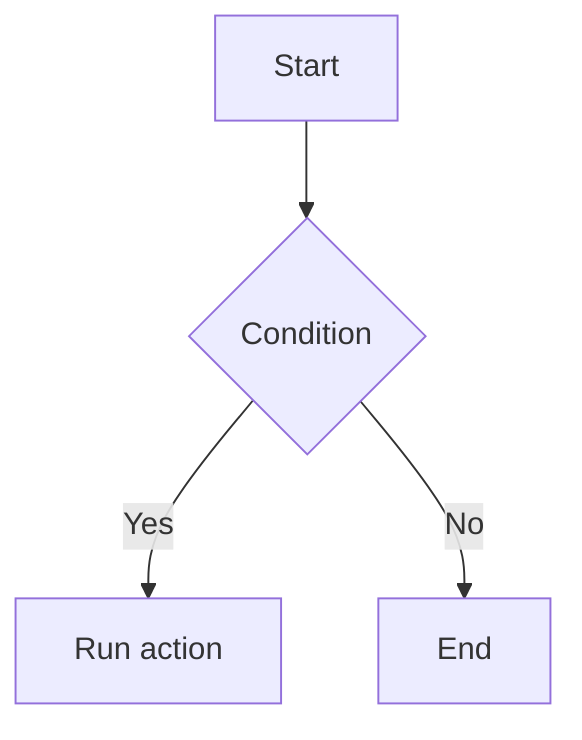

# MDC Component Reference

Movk Nuxt Docs uses Nuxt UI components with MDC syntax.

**Critical: always use the `u-` prefix for Nuxt UI components in MDC:**

```markdown
::u-page-hero      ✅ Correct (resolves to UPageHero)
::page-hero        ❌ Incorrect (does not resolve)
```

---

## Documentation Sources

**Components:**
- Component list: https://ui.nuxt.com/llms.txt
- Raw docs: `https://ui.nuxt.com/raw/docs/components/[component].md`

**Typography / Prose:**
- Introduction: https://ui.nuxt.com/raw/docs/typography.md
- Headings and text: https://ui.nuxt.com/raw/docs/typography/headers-and-text.md
- Lists and tables: https://ui.nuxt.com/raw/docs/typography/lists-and-tables.md
- Code blocks: https://ui.nuxt.com/raw/docs/typography/code-blocks.md
- Callouts: https://ui.nuxt.com/raw/docs/typography/callouts.md
- Accordion: https://ui.nuxt.com/raw/docs/typography/accordion.md
- Tabs: https://ui.nuxt.com/raw/docs/typography/tabs.md

---

## Page Layout Components

The most-used components for documentation sites:

| Component | Raw docs | Usage |
|-----------|----------|---------|
| `u-page-hero` | [page-hero.md](https://ui.nuxt.com/raw/docs/components/page-hero.md) | Landing page hero |
| `u-page-section` | [page-section.md](https://ui.nuxt.com/raw/docs/components/page-section.md) | Content section |
| `u-page-grid` | [page-grid.md](https://ui.nuxt.com/raw/docs/components/page-grid.md) | Responsive grid layout |
| `u-page-card` | [page-card.md](https://ui.nuxt.com/raw/docs/components/page-card.md) | Rich content card |
| `u-page-feature` | [page-feature.md](https://ui.nuxt.com/raw/docs/components/page-feature.md) | Feature showcase |
| `u-page-cta` | [page-cta.md](https://ui.nuxt.com/raw/docs/components/page-cta.md) | Call to action |
| `u-page-header` | [page-header.md](https://ui.nuxt.com/raw/docs/components/page-header.md) | Page header |

---

## Quick Syntax Examples

### Landing Hero with Buttons

```markdown
::u-page-hero
#title
Project Name

#description
Short description

#headline
  :::u-button{size="sm" to="/changelog" variant="outline"}
  v1.0.0 →
  :::

#links
  :::u-button{color="neutral" size="xl" to="/getting-started" trailing-icon="i-lucide-arrow-right"}
  Get started
  :::

  :::u-button{color="neutral" size="xl" to="https://github.com/..." target="_blank" variant="outline" icon="i-simple-icons-github"}
  GitHub
  :::
::
```

### Grid with Cards

```markdown
::u-page-section
  :::u-page-grid
    ::::u-page-card{spotlight class="col-span-2 lg:col-span-1" to="/feature"}
    #title
    Feature title

    #description
    Feature description
    ::::

    ::::u-page-card{spotlight class="col-span-2"}
      :::::u-color-mode-image{alt="Screenshot" class="w-full rounded-lg" dark="/images/dark.png" light="/images/light.png"}
      :::::

    #title
    Visual feature

    #description
    With light/dark mode images
    ::::
  :::
::
```

### Card with a Code Block

```markdown
::::u-page-card{spotlight class="col-span-2 md:col-span-1"}
  :::::div{.bg-elevated.rounded-lg.p-3}
  ```ts [config.ts]
  export default {
    option: 'value'
  }
  ```
  :::::

#title
Configuration

#description
Easy to configure
::::
```

---

## Content Components

| Component | Raw docs | Usage |
|-----------|----------|---------|
| `code-group` | N/A (Nuxt Content) | Multi-tab code block |
| `steps` | N/A (Nuxt Content) | Step-by-step guide |
| `tabs` | [tabs.md](https://ui.nuxt.com/raw/docs/components/tabs.md) | Tabbed content |
| `accordion` | [accordion.md](https://ui.nuxt.com/raw/docs/components/accordion.md) | Collapsible sections |

### Code Group (Nuxt Content)

```markdown
::code-group
```ts [nuxt.config.ts]
export default defineNuxtConfig({})
```

```ts [app.config.ts]
export default defineAppConfig({})
```
::
```

### Steps (Nuxt Content)

```markdown
::steps
### Install

Run the install command.

### Configure

Add your configuration.

### Use

Start using the feature.
::
```

---

## Callout Components

| Component | Usage |
|-----------|---------|
| `::note` | Additional information |
| `::tip` | Helpful suggestion |
| `::warning` | Important warning |
| `::caution` | Critical warning |

```markdown
::note{title="Custom title"}
Provide context here.
::

::tip
Pro-tip content.
::

::warning
Be careful with this feature.
::

::caution
This action cannot be undone.
::
```

---

## Images

### Color Mode Image

```markdown
:u-color-mode-image{alt="Feature" dark="/images/dark.png" light="/images/light.png" class="rounded-lg" width="859" height="400"}
```

---

## Grid Class Reference

| Class | Usage |
|-------|-------|
| `col-span-2` | Full width |
| `col-span-2 lg:col-span-1` | Full width on mobile, half width on desktop |
| `col-span-2 md:col-span-1` | Full width on mobile, half width on tablet and up |

---

## Mermaid Diagrams

````mdc

````

---

## Content Display Components

### ComponentExample

Create example components under `app/components/content/examples/`, then reference them in Markdown:

```mdc
:component-example{name="MyComponent"}
```

### ComponentProps / ComponentSlots / ComponentEmits

Auto-generate component API documentation:

```mdc
:component-props{name="Button"}
:component-slots{name="Button"}
:component-emits{name="Button"}
```

The components to document must be configured under `componentMeta.include` in `nuxt.config.ts`.

### CommitChangelog

```mdc
:commit-changelog{name="Button"}
```

### PageLastCommit

```mdc
:page-last-commit
```

---

## Complete Documentation Reference

- **All components**: https://ui.nuxt.com/llms.txt
- **Full docs (for LLMs)**: https://ui.nuxt.com/llms-full.txt
- **Typography introduction**: https://ui.nuxt.com/raw/docs/typography.md
- **Content integration**: https://ui.nuxt.com/raw/docs/getting-started/integrations/content.md
- **Theme customization**: https://ui.nuxt.com/raw/docs/getting-started/theme/components.md
