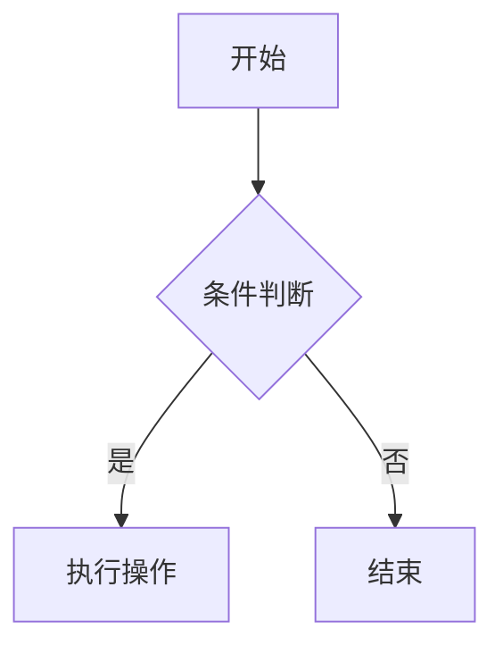

# MDC 组件参考

Movk Nuxt Docs 支持在 Markdown 中使用 Vue 组件（MDC 语法）。所有 Nuxt UI Prose 组件均可使用。

## MDC 语法规则

### 块级组件

使用 `::` 开始和结束，嵌套时增加冒号数量：

```mdc
<!-- 一层嵌套 -->
::component-name
内容
::

<!-- 两层嵌套 -->
::parent
  :::child
  内容
  :::
::

<!-- 三层嵌套 -->
::parent
  :::child
    ::::grandchild
    内容
    ::::
  :::
::
```

### 行内组件

使用单个 `:` 前缀：

```mdc
:icon{name="i-lucide-star"}
:badge[v3.0.0]
:kbd{value="meta"}
```

### 传递 Props

**行内 Props：**

```mdc
::callout{icon="i-lucide-info" color="blue"}
内容
::
```

**YAML Props（复杂属性）：**

```mdc
::component
---
icon: i-lucide-star
title: 标题
to: /docs/guide
target: _blank
---
内容
::
```

### 传递 Slots

使用 `#slot-name` 语法：

```mdc
::card
默认插槽内容

#title
标题插槽内容

#description
描述插槽内容
::
```

## 可用组件

### Callout 提示框

四种快捷方式，带预设图标和颜色：

```mdc
::note
补充信息。
::

::tip
有用的建议。
::

::warning
请谨慎操作。
::

::caution
此操作不可撤销。
::
```

也支持自定义 `callout`：

```mdc
::callout{icon="i-lucide-rocket" color="primary"}
自定义提示内容。
::
```

支持链接跳转：

```mdc
::tip{to="/docs/guide"}
点击查看指南。
::
```

### Accordion 折叠面板

```mdc
::accordion
  :::accordion-item{label="问题一" icon="i-lucide-circle-help"}
  回答内容。
  :::

  :::accordion-item{label="问题二" icon="i-lucide-circle-help"}
  回答内容。
  :::
::
```

### Tabs 标签页

```mdc
::tabs
  :::tabs-item{label="pnpm" icon="i-simple-icons-pnpm"}
  ```bash
  pnpm add @movk/nuxt-docs
  ```
  :::

  :::tabs-item{label="npm" icon="i-simple-icons-npm"}
  ```bash
  npm install @movk/nuxt-docs
  ```
  :::

  :::tabs-item{label="yarn" icon="i-simple-icons-yarn"}
  ```bash
  yarn add @movk/nuxt-docs
  ```
  :::
::
```

### Card 和 CardGroup 卡片

单个卡片：

```mdc
::card
---
icon: i-lucide-book
title: 文档标题
to: /docs/guide
---
卡片描述内容。
::
```

卡片组（网格布局）：

```mdc
::card-group
  :::card
  ---
  icon: i-lucide-rocket
  title: 快速开始
  to: /docs/getting-started
  ---
  5 分钟创建文档站点。
  :::

  :::card
  ---
  icon: i-lucide-palette
  title: 自定义主题
  to: /docs/customization
  ---
  自定义颜色、字体和布局。
  :::
::
```

### Steps 步骤

```mdc
::steps{level="4"}
#### 安装依赖

```bash [Terminal]
pnpm add @movk/nuxt-docs better-sqlite3 tailwindcss
```

#### 配置 Nuxt

```ts [nuxt.config.ts]
export default defineNuxtConfig({
  extends: ['@movk/nuxt-docs']
})
```

#### 启动开发服务器

```bash [Terminal]
pnpm dev
```
::
```

### Badge 标签

```mdc
::badge
**v1.0.0**
::
```

### Collapsible 折叠内容

```mdc
::collapsible
| 属性 | 默认值 | 类型 |
|------|--------|------|
| `name` | - | `string` |
| `size` | `md` | `string` |
::
```

### Field 和 FieldGroup 字段说明

```mdc
::field-group
  :::field{name="title" type="string"}
  页面标题，显示在浏览器标签和导航中。
  :::

  :::field{name="description" type="string"}
  页面描述，用于 SEO meta 标签。
  :::
::
```

### Icon 图标

```mdc
:icon{name="i-lucide-star"}
:icon{name="i-simple-icons-github"}
```

图标集：
- **Lucide**：`i-lucide-*`（默认图标集）
- **Simple Icons**：`i-simple-icons-*`（品牌图标）

### Kbd 键盘快捷键

```mdc
:kbd{value="meta"} :kbd{value="K"}
```

### Mermaid 图表

````mdc

````

## 内容展示组件

### ComponentExample 组件示例

在 `app/components/content/examples/` 目录下创建示例组件，然后在 Markdown 中引用：

```mdc
:component-example{name="MyComponent"}
```

### ComponentProps / ComponentSlots / ComponentEmits

自动生成组件 API 文档：

```mdc
:component-props{name="Button"}
:component-slots{name="Button"}
:component-emits{name="Button"}
```

需要在 `nuxt.config.ts` 的 `componentMeta.include` 中配置要生成文档的组件。

### CommitChangelog 提交日志

```mdc
:commit-changelog{name="Button"}
```

### PageLastCommit 最后更新时间

```mdc
:page-last-commit
```

## 代码块

### 语言标识和文件名

```mdc
```ts [nuxt.config.ts]
export default defineNuxtConfig({})
```
```

### 代码组

````mdc
::code-group
```ts [nuxt.config.ts]
export default defineNuxtConfig({
  extends: ['@movk/nuxt-docs']
})
```

```json [package.json]
{
  "dependencies": {
    "@movk/nuxt-docs": "latest"
  }
}
```
::
````

### 代码预览

````mdc
::code-preview
预览内容

#code
```mdc
预览对应的代码
```
::
````

### Diff 高亮

```mdc
```diff [nuxt.config.ts]
export default defineNuxtConfig({
+  extends: ['@movk/nuxt-docs']
})
```
```

## 页面模板

### 入门页面模板

```md
---
title: 快速开始
description: 5 分钟创建你的文档站点。
---

## 安装

::steps{level="3"}
### 创建项目

```bash [Terminal]
npx nuxi init -t gh:mhaibaraai/movk-nuxt-docs/templates/default my-docs
```

### 启动开发服务器

```bash [Terminal]
cd my-docs
pnpm dev
```
::

## 下一步

::card-group
  :::card{icon="i-lucide-settings" title="配置" to="/docs/configuration"}
  自定义站点设置。
  :::

  :::card{icon="i-lucide-palette" title="主题" to="/docs/customization"}
  调整外观和主题。
  :::
::
```

### 功能介绍页面模板

```md
---
title: 功能名称
description: 功能的简短描述。
---

## 概述

功能介绍...

## 基础用法

基本使用说明...

::note
补充说明信息。
::

## 配置选项

| 选项 | 类型 | 默认值 | 描述 |
|------|------|--------|------|
| `option1` | `string` | - | 选项说明 |
| `option2` | `boolean` | `true` | 选项说明 |

## 示例

代码示例...
```
